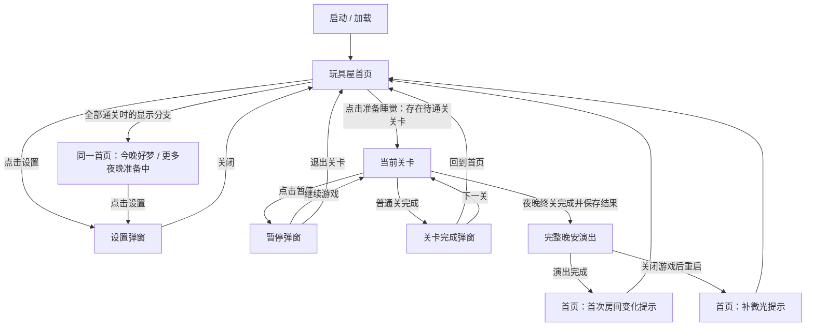
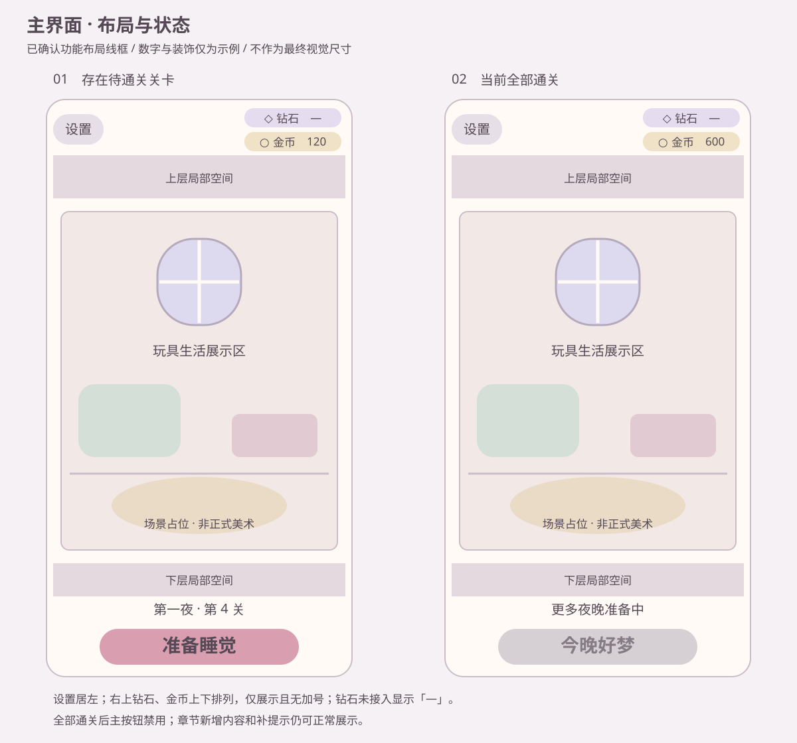
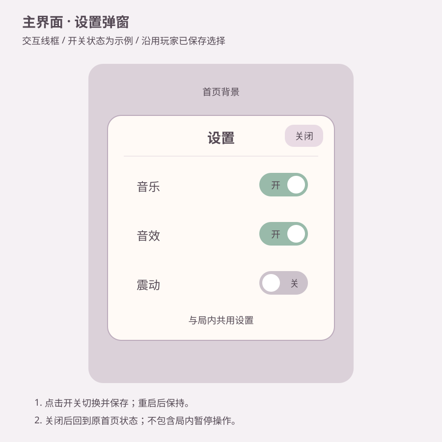

# 《晚安，玩具屋》主界面系统 MDD

## 0. 文档基本信息

| 项目 | 内容 |
| --- | --- |
| 版本 / 日期 | v1.1 / 2026.09.19（沿用文件名） |
| 状态 | 用户已确认规则与布局；策划需求稿 |
| 模块 | 主界面系统 · 基础版 |
| 平台与画面 | Android、iOS；竖屏，参考分辨率 1080×1920 |
| 编写依据 | 本次设计锁定记录、GDD v1.4 第 5.3 节、核心玩法 MDD v1.3 |
| 模板 | 项目《MDD 模版 v1.6》，仅保留适用章节，沿用章节编号 |
| 验证范围 | 文档规则、界面关系与流程推演；不代表运行时已实现或验收 |

### 0.1 修订记录

| 版本 | 日期 | 修改人 | 变更 |
| --- | --- | --- | --- |
| v1.0 | 2026.09.19 | Codex | 落实用户确认的基础首页、进关、章节变化、设置及中断恢复规则 |

| v1.1 | 2026.09.19 | Codex | 按核心玩法顶部结构修订：设置居左，右侧上钻石、下金币双货币栏 |

### 0.2 来源与版本差异

- 本次用户确认是主界面规则与布局的直接依据。
- GDD 提供纵向剖面娃屋、生活展示、夜晚成长及「准备睡觉」包装。
- 核心玩法 MDD v1.3 提供通关奖励、普通关回首页 / 下一关、退出不保留盘面的规则。
- GDD 中「MVP 无金币」已与最新核心玩法需求不一致；本模块采用已确认的金币展示规则。普通关结束去向采用最新核心玩法 MDD，不采用 GDD 的直接接下一关简述。
- 本次只交付主界面文档与线框附件，不宣称 GDD、现有代码或其他历史附件已经同步。

## 1. 模块概述

### 1.1 设计目的

1. 让玩家在回到玩具屋后，一步进入当前待通关关卡。
2. 用玩具生活及章节后的房间变化承接陪伴感与成长反馈。

### 1.2 范围

包含固定一屏娃屋、章节与关卡展示、闯关入口、金币与钻石货币栏、设置、章节变化提示。

本次不包含玩具册、夜晚记录、选关与重玩入口、自由装修、玩具点击互动；房间中的生活动作仅作展示。

## 2. 系统结构与名词解释

| 功能对象 | 职责 |
| --- | --- |
| 娃屋 | 展示当前房间状态、玩具生活和章节新增内容 |
| 闯关区 | 展示当前待通关关卡，提供进入操作及全部通关状态 |
| 货币区 | 右上双行展示钻石与金币 |
| 设置弹窗 | 调整音乐、音效、震动 |

**当前待通关关卡**：沿既定关卡顺序下一次应进入的未完成关卡；退出未完成关卡不推进该进度。

**夜晚**：由多个关卡组成的章节，不指现实日期；完成夜晚终关后进入章节完成流程。

**全部通关**：当前提供的关卡均已完成，没有下一关可进入。

## 3. 入口

| 来源 | 进入首页的时机 |
| --- | --- |
| 启动游戏 | 加载完成后 |
| 普通关卡完成弹窗 | 点击「回到首页」 |
| 局内暂停弹窗 | 点击「退出关卡」 |
| 夜晚终关 | 完整晚安演出结束后 |
| 晚安演出被关闭游戏打断 | 下次启动完成加载后 |

## 4. 系统规则

### 4.1 闯关与进度

1. 首页读取已有通关记录，确定当前待通关关卡；首次游玩进入第一夜第一关。
2. 点击「准备睡觉」直接进入该关，不经过选关页。
3. 普通关完成后，按核心玩法 MDD 结算并推进进度；回首页时指向下一待通关关卡。
4. 未完成关卡中途退出后，仍指向该关；下次进入从初始盘面开始，不恢复上次盘面，保留金币和已通关记录。
5. 当前全部关卡完成后，不再提供可进入的关卡；首页表现见 5.2。

### 4.2 房间与章节变化

1. 固定一屏，以一间主房间为中心，上下露出局部空间，不提供上下滚动浏览。
2. 房间中的玩具可展示待机和生活动作，不参与 Puzzle，也不提供本次范围以外的点击互动。
3. 每完成一个夜晚，自动更新该章节对应的房间内容，无需玩家领取或选择装修方案。
4. 房间新增内容可为家具、装饰或玩具，具体内容由章节美术配置提供，不把 GDD 中的举例视作首章正式奖励清单。
5. 正常流程在完整晚安演出后返回首页，首次回家以短暂镜头或微光提示新增内容。固定一屏浏览规则保持不变。
6. 变化提示只承担展示作用；房间变化不以玩家是否看到提示为生效条件。

### 4.3 章节完成与中断恢复

1. 夜晚终关完成时，先保存通关奖励、章节进度与房间变化，再播放完整晚安演出。
2. 若在演出期间关闭游戏，下次启动直接回首页，补一次新增内容微光提示，不重播完整晚安演出。
3. 恢复时沿用已保存结果，不重复发奖、不重复增加房间内容。
4. 提示完成后，再次返回首页不重复提示该次变化。
5. 房间提示与是否有下一关分别判断：即使已经全部通关，仍展示已生效的房间变化及应补的提示。

### 4.4 设置

1. 提供音乐、音效、震动三个开关，与局内设置共用同一份玩家选择。
2. 修改后保存；关闭弹窗或重新启动，不恢复成修改前的设置。
3. 首页读取已保存设置，不另外定义一套默认值。

## 5. 界面与交互

### 5.1 界面关系

「全部通关」是首页显示状态，不是独立页面。暂停、局内、结算与完整晚安演出为关联系统页面；此图仅列与首页有关的往返路径，其完整交互以所属系统文档为准。

### 5.2 首页及全部通关状态

线框用于表达已确认区域与控件关系；图中余额、关卡、装饰和开关状态均为示例，颜色、尺寸及摆件造型不是最终美术规格。

| 从上到下的区域 | 显示与交互 |
| --- | --- |
| 左上设置 | 沿用核心玩法左侧入口区域，使用设置图标；点击打开设置弹窗，全部通关时仍保留 |
| 右上货币栏 | 沿用核心玩法双行圆角底板布局，上排钻石、下排金币；各行左侧货币图标、右侧数量。金币读取真实余额，钻石未接入时显示「—」，接入后显示实际余额；无加号，不可点击，回首页刷新 |
| 中间娃屋 | 展示当前房间状态；新增内容提示遵循 4.2、4.3 |
| 底部进度 | 使用「第一夜 · 第 4 关」格式，显示待通关目标；不增加「已完成 3/10」进度条 |
| 底部主按钮 | 可进关时显示「准备睡觉」，视觉优先级最高；执行 4.1 |
| 全部通关状态 | 主按钮改为「今晚好梦」并禁用，显示「更多夜晚准备中」；不展示虚构的下一关编号 |

### 5.3 设置弹窗

| 控件 | 显示与交互 |
| --- | --- |
| 标题 | 设置 |
| 音乐 / 音效 / 震动 | 每行一个开关，显示对应的已保存状态；点击切换，保存规则见 4.4 |
| 关闭 | 关闭弹窗，回到原首页及其原有通关状态 |

本弹窗为首页设置，不加入局内的「重新开始」「继续游戏」「退出关卡」按钮。

## 6. 配置与玩家数据需求

以下为业务数据需求，不宣称工程中已存在同名配置表。

| 数据来源 | 首页需要的内容 | 用途 |
| --- | --- | --- |
| 关卡与章节配置 | 关卡顺序、夜晚归属、显示编号、终关标识、当前提供的关卡范围 | 进关目标、进度展示和全部通关判定 |
| 房间展示配置 | 初始房间内容、每个夜晚完成后的新增内容及提示对象 | 章节成长与变化定位 |
| 文案资源 | 准备睡觉、今晚好梦、更多夜晚准备中、设置及三个开关名称 | 页面文案 |
| 玩家进度 | 已通关关卡、已完成夜晚 | 恢复当前待通关目标 |
| 玩家资源 | 金币余额、钻石余额接入状态及余额、通关奖励结算记录 | 展示双货币栏；未接入不伪造钻石数量，避免重复结算 |
| 玩家房间状态 | 已生效的章节变化、变化提示是否完成 | 保持房间成长及补提示 |
| 玩家设置 | 音乐、音效、震动选择 | 首页与局内一致 |

具体装饰资源、每章内容清单、摆放坐标、动画时长与最终视觉尺寸属于后续美术配置交付，不在本稿中擅自锁定。本文不新增正式数值或测试经济参数。

## 8. 货币关联

通关固定奖励 **30 金币**，结算及防重复发奖由核心玩法系统负责。首页只展示已有余额，不承担领取或消费；回家、打开设置、房间变化提示均不是额外发奖时机。

钻石栏是本次用户追加的首页展示要求。当前核心玩法第二货币使用星形资源图标，代码显示「—」，尚无钻石余额接入；主界面按「钻石」命名，后续图标需与其含义一致。本次不新增钻石获得、消耗或购买规则。双栏保持此前已确认的仅展示、无加号交互。

## 9. 关联系统

| 系统 | 业务依赖 |
| --- | --- |
| 核心玩法 | 按进关目标创建初始盘面；提供普通关完成与退出首页路径 |
| 关卡 / 章节 | 提供推进顺序、终关判定及完整晚安演出；保存章节完成结果 |
| 玩具屋成长 | 提供章节新增内容和当前房间状态 |
| 货币 | 提供金币余额和已结算结果；提供钻石余额及接入状态 |
| 设置 / 本地保存 | 保存并恢复玩家进度、房间变化提示状态与三个开关 |

## 13. 验收标准

以下为待执行验收用例；本次仅完成文档推演与静态检查。

| 编号 | 场景 / 操作 | 预期结果 | 依据 |
| --- | --- | --- | --- |
| H01 | 首次启动并点击主按钮 | 首页指向第一夜第一关，一步进关，无选关页 | 4.1 |
| H02 | 第 4 关通关后选择回首页 | 余额增加本次 30 金币，显示第 5 关；再次进首页不重复发奖 | 4.1、8 |
| H03 | 第 4 关中途退出，再次开始 | 仍进入第 4 关初始盘面；已通关记录和现有金币保留 | 4.1 |
| H04 | 夜晚终关正常完成 | 保存结果，晚安演出后回家，展示该章节房间变化 | 4.2、4.3 |
| H05 | 晚安演出期间关闭并重启 | 直接回家，补微光提示；不重播演出、不重复发奖或增加内容 | 4.3 |
| H06 | 变化提示已完成，再次回家 | 房间变化保持，不重复该次提示 | 4.3 |
| H07 | 全部关卡完成 | 「今晚好梦」禁用，显示准备中文案，无虚构下一关；金币、钻石栏与设置仍可见 | 5.2 |
| H08 | 最后一夜演出被打断后重启 | 同时满足 H05 与 H07，不因全部通关而遗漏变化提示 | 4.3 |
| H09 | 修改任意设置，关闭弹窗并进关 / 重启 | 所有入口显示并使用同一已保存选择 | 4.4 |
| H10 | 点击金币或钻石栏、尝试上下滑动或点击房间玩具 | 无货币跳转页面，无滚动浏览，无额外玩具互动功能 | 1.2、4.2、5.2 |

| H11 | 检查首页顶部及全部通关状态 | 设置在左上；右上钻石在上、金币在下；钻石未接入显示「—」 | 5.2、8 |

### 13.1 已完成的设计推演

- 正常路径：第 4 关通关 → 结算 → 回家显示第 5 关 → 进入第 5 关。结果由 4.1、8 唯一确定。
- 中断路径：终关完成并保存 → 晚安演出中退出 → 重启回家 → 补变化提示 → 依是否仍有下一关显示可进关或全部通关状态。结果由 4.3、5.2 唯一确定。

## 15. 附件与来源

- 顶部布局参考：项目根目录《核心玩法效果图.png》，并核对当前核心玩法资源栏绘制；继承布局，不继承未开放的加号入口。
- [GDD v1.4](../../../../《晚安，玩具屋》游戏设计文档%20GDD.md)
- [核心玩法 MDD v1.3（沿用 v1.0 文件名）](../../核心玩法系统/00-主MDD/MDD-核心玩法系统.v1.0.md)
- [项目 MDD 模版 v1.6](../../../../参考资料/MDD模版v1.6.md)
- [首页与全部通关状态线框](../assets/主界面-布局与状态.svg)
- [设置弹窗线框](../assets/主界面-设置弹窗.svg)
