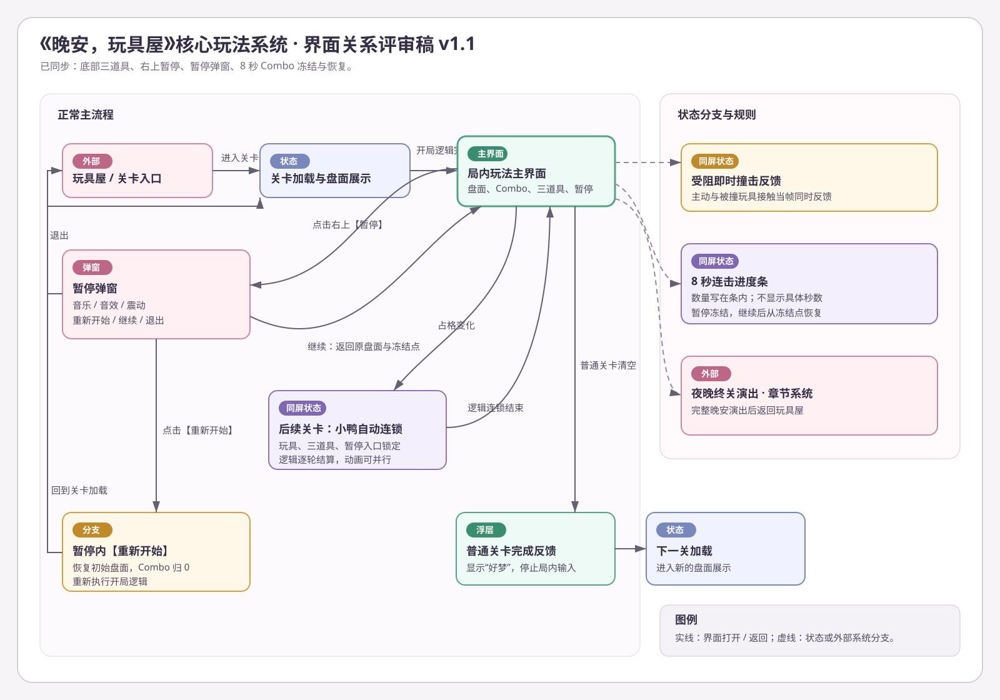
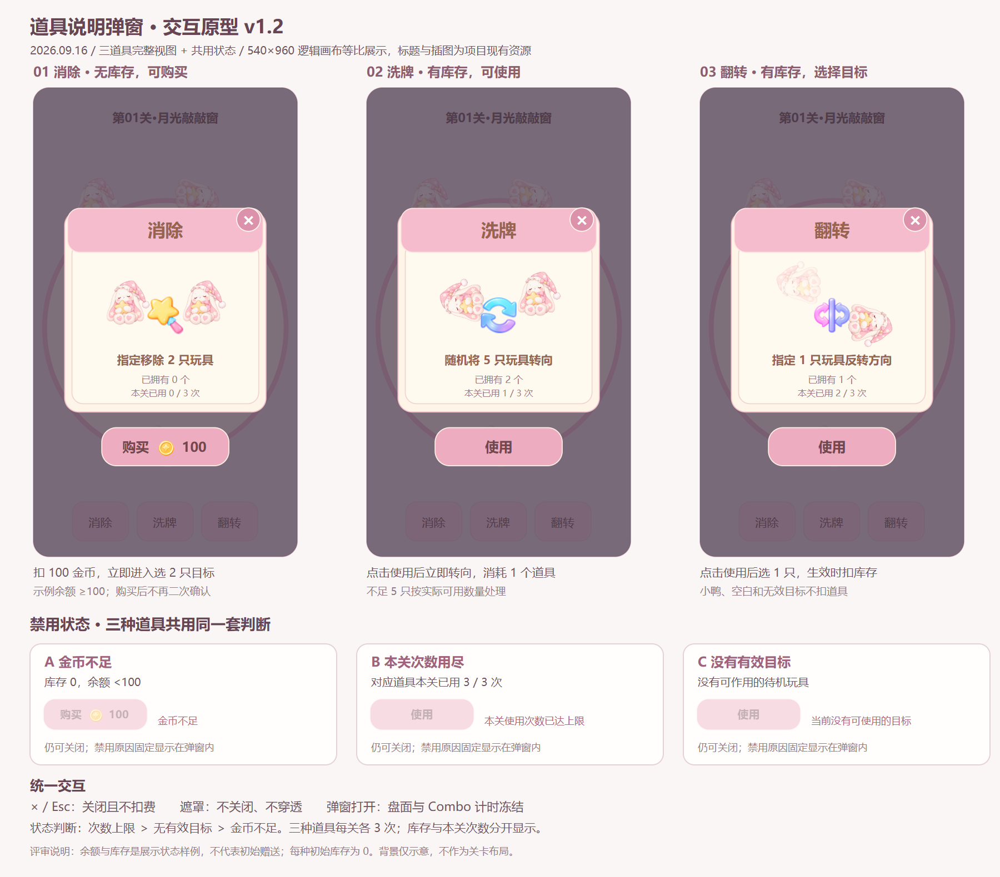

# 《晚安，玩具屋》核心玩法系统 MDD

## 0. 文档基本信息

### 0.1 模块名称

核心玩法系统

### 0.2 模块信息

| 项目 | 内容 |
| --- | --- |
| 模块所属大类 | 核心玩法 |
| 文档版本 | v1.3（沿用原文件名，保持引用有效） |
| 编写日期 | 2026.08.29 |
| 更新日期 | 2026.09.19 |
| 文档状态 | 规则已确认，MVP 开发稿 |
| 目标平台 | Android、iOS；Windows PC 用于开发与调试 |
| 屏幕方向 | 竖屏，参考分辨率 1080×1920 |
| GDD 来源 | [《晚安，玩具屋》游戏设计文档 GDD v1.4](../../../../《晚安，玩具屋》游戏设计文档%20GDD.md) |
| UI 交互文档 | [《UI-核心玩法系统界面交互说明》v1.3](../ui/UI-核心玩法系统界面交互说明.v1.0.md) |
| 配置设计说明 | [《配置-核心玩法系统-主模块-配置表设计说明》v1.2](../cfg/_main/配置-核心玩法系统-主模块-配置表设计说明.v1.0.md) |
| 数值工作簿 | [《数值-核心玩法系统设计工作簿》v1.0](数值-核心玩法系统设计工作簿.v1.0.xlsx) |

### 0.3 修订记录

| 版本号 | 编写日期 | 修改人 | 变更记录 | 备注 |
| --- | --- | --- | --- | --- |
| v1.0 | 2026.08.29 | Codex | 从 GDD v1.4 提取核心玩法规则，形成开发与验收口径 | 首版 |
| v1.1 | 2026.08.31 | Codex | 局内底部改为三道具，提示按钮移除，重开移入暂停弹窗 | 交互规则更新 |
| v1.2 | 2026.09.16 | Codex | 同步本任务中 v5 资源、圆毯、兔子方向与大小、粉色连击条、去飘字、关卡标题及道具说明/库存/购买/每关限次 | 用户确认规则与实现补充分别标注 |
| v1.2 补图 | 2026.09.16 | Codex | 补齐道具说明弹窗三道具原型、禁用状态与操作流程图 | SVG 源图及 PNG 预览 |

| v1.3 | 2026.09.19 | Codex | 通关奖励 30 金币；完成弹窗增加回到首页、下一关；取消自动进关并同步验收 | 文档需求更新 |

### 0.4 本次同步范围与依据

- v1.3 用户确认：完成关卡固定奖励 30 金币；普通关卡完成弹窗增加【回到首页】【下一关】，取消定时自动进关。本次更新主 MDD 与 UI 说明及验收条目；属于需求更新，普通关卡完成弹窗 SVG 已同步；运行时、配置说明、数值工作簿及其余历史图稿尚未同步。
- 用户确认：三道具初始各 0 个、每种每关上限 3 次、单个 100 金币；有库存使用、无库存购买后立即使用；任务、成就和看广告是后续获取渠道。UI 调整见第 5.3 节。
- 实现补充：有效生效才扣库存与次数、购买后取消选目标保留道具、按关卡 ID 持久保存已用次数等，见第 4.6 节。这些边界记录当前实现，不视为用户另外确认的经济决策。
- 待确认：新玩家初始金币当前暂设 0；初始赠送及任务、成就、广告等奖励数量未锁定。通关奖励已确定为 30 金币。任务、成就、广告仅有发奖接口，尚未接入实际系统。
- v1.2 更新了主 MDD、关联 UI 与配置说明。旧数值工作簿、SVG、效果图和 ADD 保留为历史附件，未重制；涉及本次改动时以本版正文为准，旧“无限提示”、旧飘字、旧道具直用流程不再作为验收依据。

---

# 1. 模块概述

## 1.1 模块概括

1. 核心玩法以高密度竖屏盘面为载体，玩家通过点击固定方向的兔子或鲸鱼逐步解除阻挡，最终清空全部玩具。
2. 小鸭不受面朝方向限制；当四方向空格能够连通盘面边缘缺口时，小鸭自动寻路离场。
3. 每次盘面占格变化后，系统逐轮扫描小鸭，直到没有新的小鸭满足自动离场条件。
4. 任意有效离场均增加连击；连续 8 秒没有有效离场时连击中断。
5. 系统同时提供消除、洗牌、翻转三个道具，右上暂停入口，受阻撞击反馈、普通关卡完成与夜晚终关完成触发。

## 1.2 设计目的

1. 让玩家从几十个互相阻挡的玩具中找到当前突破口，持续获得“拥挤盘面逐层松开”的解题反馈。
2. 通过手动单位与自动离场小鸭的组合，制造由单次点击引发多轮连锁清盘的爽感。
3. 在没有步数、生命或失败惩罚的前提下，保持清晰、连续、低压力的移动端碎片化体验。

## 1.3 模块范围与不做内容

**本模块包含：**

- 单局盘面展示与玩家输入时序；
- 三种功能原型的玩法规则；
- 占格、直线路径、阻挡、撞击与离场；
- 小鸭自动寻路与逐轮连锁；
- 连击、三个局内道具与暂停弹窗；
- 清空判定及对关卡、章节系统的完成通知。

**本模块不包含：**

- 关卡具体布局、单位数量配比与难度曲线；
- 第一夜各关的教学编排；
- 夜晚终关完整演出内容；
- 玩具皮肤的解锁与收集；
- 三种 MVP 道具以外的局内道具；
- Undo、生命、步数与传统失败结算；
- 程序内部寻路算法、碰撞算法或代码架构。

---

# 2. 系统结构与名词解释

## 2.1 功能结构

- 核心玩法系统
  - 单局盘面
    - 盘面展示
    - 输入锁定与恢复
    - 清空判定
  - 手动玩具
    - 兔子
    - 鲸鱼
    - 固定方向移动
    - 受阻与即时撞击反馈
    - 成功离场
  - 自动离场玩具
    - 小鸭四方向可达判定
    - 逐轮扫描
    - 自动寻路离场
  - 局内反馈
    - 连击进度条
    - 消除、洗牌、翻转
    - 暂停弹窗
  - 关卡完成
    - 普通关卡完成
    - 夜晚终关完成通知

## 2.2 名词解释

`功能原型`：决定玩具占格、操作方式和离场规则的玩法类型；皮肤不改变功能原型。

`普通玩具`：占据 1×2 格的手动玩具，默认皮肤为兔子。

`自动离场玩具`：占据 1×1 格、满足缺口条件后自行寻路离场的玩具，默认皮肤为小鸭。

`大型玩具`：占据 1×3 格的手动玩具，默认皮肤为鲸鱼。

`缺口`：从小鸭当前格出发，经四方向相邻空格能够抵达的任意盘面边缘出口。

`占格变化`：任意玩具离场，或兔子、鲸鱼受阻后停在新位置，导致盘面已占用格发生变化。

`一轮小鸭扫描`：在同一份当前盘面状态下，找出全部符合自动离场条件的小鸭并加入本轮离场队列。

`有效离场`：兔子、鲸鱼从对应边缘离场，或小鸭经自动寻路离场；每只离场玩具分别计为一次。

`连击中断`：从上一次有效离场开始计时，满 8.000 秒仍没有下一只有效离场玩具。

---

# 3. 开启条件与入口

## 3.1 入口

1. 玩家从玩具屋或章节流程进入当前关卡后，打开局内玩法界面。
2. 关卡完成盘面展示后，先执行开局小鸭自动离场结算；结算完成后才开放玩家输入。
3. 关卡完成后结算 30 金币；普通关卡打开完成弹窗，选择【回到首页】返回玩具屋首页，或选择【下一关】进入下一关加载；夜晚终关仍通知章节系统进入完整晚安演出。

界面关系与所有返回路径详见：[核心玩法系统界面关系评审稿](../assets/核心玩法系统-界面关系评审稿.svg)。

---

# 4. 系统规则

## 4.1 单局盘面与输入时序

1. 关卡加载后一次性展示当前关卡的完整盘面；玩家不可见实际格线。
2. 盘面展示完成后，系统锁定玩家输入，并执行开局小鸭自动离场结算。
3. 开局自动结算完成后，若盘面仍有玩具，恢复玩家输入。
4. 玩家可点击处于待机状态的兔子或鲸鱼；小鸭不可点击。
5. 小鸭自动连锁期间，锁定玩具、底部道具和【暂停】输入。
6. 小鸭逻辑连锁全部结算后恢复输入，不等待所有小鸭离场动画逐只串行播放完毕。
7. 兔子或鲸鱼播放受阻反馈时，若没有触发小鸭自动连锁，玩家仍可点击其他处于待机状态的手动玩具。
8. 同一玩具处于移动、离场或受阻反馈状态时，重复点击不产生新的移动命令。
9. 每次玩具数量变化后检查剩余玩具数；剩余数为 0 时进入关卡完成规则。

### 4.1.1 局内阶段

| 阶段 | 进入条件 | 可接受操作 | 退出条件 |
| --- | --- | --- | --- |
| 盘面展示 | 关卡内容创建完成 | 无 | 展示完成 |
| 自动结算 | 开局展示完成或占格发生变化 | 无 | 没有符合条件的小鸭 |
| 玩家操作 | 自动结算完成且仍有玩具 | 点击兔子、鲸鱼、三个道具、暂停 | 触发占格变化、打开道具说明/暂停或清空 |
| 道具说明 | 点击底部道具 | 关闭、符合条件时购买或使用；盘面和计时冻结 | 关闭弹窗或进入道具执行/选择 |
| 完成等待 | 剩余玩具数为 0 | 无 | 当前离场表现结束 |
| 关卡完成 | 完成等待结束，结算 30 金币 | 普通关卡选择【回到首页】【下一关】；终关转交章节系统 | 返回首页、进入下一关或章节演出 |

## 4.2 兔子与鲸鱼

### 4.2.1 占格与方向

1. 兔子占据 1×2 格；横向放置时为 2×1，纵向放置时为 1×2。
2. 鲸鱼占据 1×3 格；横向放置时为 3×1，纵向放置时为 1×3。
3. 每只兔子与鲸鱼固定为上、下、左、右四个方向之一。
4. 玩家不能拖动或直接调整位置；方向仅可通过洗牌、翻转道具改变。
5. 手动玩具只沿头部朝向直线移动；兔子以耳朵朝向明确表示前进方向，横向兔子也须正确旋转。

### 4.2.2 点击与路径结果

1. 玩家点击待机中的兔子或鲸鱼后，检查其头部前方直到对应盘面边缘的直线路径。
2. 若路径内没有其他玩具占格，该玩具沿固定方向离场。
3. 若路径内存在其他玩具，该玩具向前移动并停在首个阻挡物前。
4. 若点击时已经紧贴阻挡物，则位置不变，直接进入撞击反馈。
5. 手动玩具受阻后若停在新位置，先更新盘面占格，再触发小鸭自动离场结算。

### 4.2.3 成功离场

1. 兔子或鲸鱼沿固定方向快速移动并越过对应盘面边缘。
2. 越过玩法边缘后，该玩具释放占格，剩余玩具数减 1。
3. 该玩具计为一次有效离场，连击按第 4.5 节处理。
4. 占格释放后立即触发小鸭自动离场结算。
5. 离场动画目标时长为 0.4～0.8 秒；该范围为 GDD 正式体验目标。

## 4.3 受阻与撞击反馈

1. 兔子或鲸鱼与阻挡玩具发生接触的当帧，主动玩具与被撞玩具同时播放撞击反馈，不增加额外延时。
2. 两个玩具均播放沿撞击方向的短促回弹、高亮描边和撞击粒子。
3. 撞击反馈不扣生命、不扣步数、不触发关卡失败，也不立即中断连击。
4. 撞击反馈不得阻止玩家继续点击其他待机玩具；若该次受阻移动触发小鸭自动连锁，则按自动结算规则锁定输入。
5. 小鸭不可由玩家点击移动，因此不进入“点击受阻”规则；小鸭仍可作为兔子或鲸鱼的被撞对象并播放被撞反馈。
6. 撞击反馈时长暂用 0.18 秒 `[测试数据]`，用于原型联调；正式值通过手机实机验证后替换。

## 4.4 小鸭自动离场

### 4.4.1 可离场条件

1. 小鸭固定占据 1×1 格，不受面朝方向限制。
2. 判定从小鸭自身格开始；自身格直接贴合边缘出口时，路径长度可以为 0。
3. 否则，小鸭必须能经过上、下、左、右相邻空格抵达任意边缘出口。
4. 路径不能穿过任何其他玩具的占格。
5. 小鸭的视觉朝向只用于寻路动画中的转身表现，不参与路径判定。

### 4.4.2 扫描触发

以下任一情况发生时，启动小鸭自动离场结算：

1. 关卡盘面展示完成；
2. 兔子或鲸鱼成功离场并释放占格；
3. 兔子或鲸鱼受阻后停在新位置并改变占格；
4. 上一轮小鸭逻辑离场并释放占格。

### 4.4.3 逐轮结算

1. 锁定玩家输入后，扫描全部待机小鸭。
2. 按当前盘面状态，将全部存在可达缺口的小鸭加入本轮离场队列。
3. 本轮队列为空时，结束自动结算并恢复玩家输入。
4. 本轮队列不为空时，队列中每只小鸭分别完成逻辑离场：释放自身占格、剩余玩具数减 1、连击加 1并刷新倒计时。
5. 本轮全部逻辑离场后，根据更新后的盘面重新扫描下一轮。
6. 重复扫描，直到没有符合条件的小鸭。
7. 同一轮及不同轮已确定离场的小鸭动画允许并行播放。
8. 玩家输入恢复以逻辑连锁是否全部结算为准，不以视觉动画是否全部结束为准。
9. 若某轮逻辑离场后剩余玩具数为 0，完成本轮结算后进入完成等待，不再恢复局内操作。

## 4.5 连击

### 4.5.1 增加与刷新

1. 每只有效离场玩具分别使连击数加 1。
2. 兔子、鲸鱼和小鸭使用同一套连击计数。
3. 同一轮多只小鸭逻辑离场时，每只小鸭依次增加一次连击；动画是否并行不影响计数次数。
4. 每次有效离场后，将连击倒计时刷新为 8.000 秒。
5. 开局自动离场的小鸭同样增加连击并显示连击进度条。

### 4.5.2 连续性与边界

1. 下一只玩具必须在倒计时归零前完成有效离场，才能延续上一次连击。
2. 两次有效离场的时间差小于 8.000 秒时，连击连续。
3. 两次有效离场的时间差大于或等于 8.000 秒时，原连击先中断；当前这只玩具作为新一轮连击的第 1 只。
4. 恰好 8.000 秒发生有效离场，视为原连击已经中断。
5. 倒计时归零时连击数归 0，并隐藏连击进度条。
6. 点击受阻或使用局内道具不会立即清零连击；打开暂停或道具说明弹窗后倒计时冻结，关闭后从冻结点恢复。
7. 重新开始关卡后连击直接归 0。
8. MVP 中连击只影响视觉和音效反馈，不提供经济奖励。

### 4.5.3 界面表现

1. 连击数为 0 时不显示连击进度条。
2. 首次有效离场后显示连击组件，数量与进度条同组展示；填充统一粉色，不再出现粉色、金色两截。
3. 不显示具体剩余秒数，也不显示条下方“待归位 70/72”等小字。
4. 每次有效离场后进度条立即回满，再按 8 秒线性缩短。
5. 进入普通关卡完成反馈或夜晚终关演出时，连击进度条随局内界面退出，不参与结算。

## 4.6 局内道具

### 4.6.1 道具效果与基本规则

| 道具 | 效果 | 有效目标与不足处理（当前实现） |
| --- | --- | --- |
| 消除 | 指定移除 2 只玩具 | 选择不同的待机玩具，可包含小鸭；仅剩 1 只时允许移除该只 |
| 洗牌 | 随机将 5 只玩具转向 | 仅待机、未移动的兔子或鲸鱼；不足 5 只按实际数量，优先合法 90° 转向，空间不足时反转 180° |
| 翻转 | 指定 1 只玩具反转方向 | 仅待机、未移动的兔子或鲸鱼；方向反转 180°，小鸭无效 |

1. 底部只显示【消除】【洗牌】【翻转】及各自库存角标；不显示“选2只”“随机5只”“选1只”小字，不显示常驻提示或重开按钮。
2. 三种道具初始库存均为 **0**，各自每关最多成功使用 **3 次**，互不占用次数。
3. 库存数量与本关次数分别记录；底部角标显示库存，弹窗显示库存和“本关已用 n / 3 次”。
4. 小鸭自动连锁、玩具移动或离场动画尚未结束、暂停、关卡完成等待及完成反馈期间，不打开道具说明弹窗。弹窗接管输入时，其他道具与盘面不可操作。

### 4.6.2 说明、购买与使用

1. 点击道具先打开该道具说明弹窗，展示名称、示意图、用途、库存、已用次数、关闭按钮及主操作按钮；点击道具入口本身不扣费、不使用。
2. 库存 ≥1：主按钮显示【使用】，使用库存，不消耗金币。
3. 库存为 0：主按钮显示【购买】、金币图标与 **100**。余额不少于 100、未达次数上限且存在有效目标时才可确认。
4. 确认购买时扣 100 金币并获得 1 个对应道具，随后立即执行洗牌，或关闭弹窗进入消除/翻转的目标选择；不需要再次点击【使用】。
5. 使用次数达到 3 时，即使库存或金币充足也禁止本关再次使用或购买。禁用原因优先显示“本关使用次数已达上限”，其次无可用目标，再其次“金币不足”；原因固定显示在弹窗内，不使用飘字。
6. 说明弹窗打开期间，盘面、游戏时间和 Combo 倒计时冻结；点击遮罩不关闭、不穿透。关闭按钮或 Esc 返回原盘面，不扣金币、库存或次数。

### 4.6.3 扣除时点、取消与存档（实现补充）

1. 道具成功生效时，扣 1 个库存并增加对应道具 1 次本关使用次数。消除完成所需选择、翻转命中有效目标时才扣除；洗牌确认执行时扣除。
2. 点击空白、无效目标或对小鸭使用翻转，不扣库存与次数。
3. 取消选目标不扣库存和次数；若此前购买已经成功，金币不退，未使用道具保留在背包。Esc、打开暂停或重新打开道具说明会取消未完成的选择。
4. 金币和库存跨关保留；使用次数按关卡 ID 保存。重开、退出重进、刷新均不重置同一关的已用次数；首次进入新关各为 0/3。
5. 当前使用浏览器本地存档；跨设备、跨域同步尚未实现。清除浏览器存档后按新玩家初始化。

### 4.6.4 获取渠道与实现边界

1. 当前已实现金币购买、本地余额/库存保存及奖励发放接口。
2. 后续任务、成就、激励广告可发放金币或道具；相同来源和奖励 ID 重复回调不得重复发奖，奖励不增加本关使用上限。
3. 任务、成就判定与广告 SDK 尚未接入，不展示参考图中的视频或分享领取按钮。
4. 初始金币暂用 **0 `[待确认]`**；通关奖励已锁定为 **30 金币**（第 4.8 节），其他来源奖励数量未锁定，不能把联调奖励作为正式赠送。

## 4.7 暂停与重新开始

1. 【暂停】位于局内右上角，只在玩家操作阶段可点击；小鸭自动连锁期间不可点击。
2. 点击后遮暗局内画面并打开暂停弹窗，冻结游戏时间、玩具移动、撞击反馈、结算等待与 Combo 倒计时。
3. 弹窗提供背景音乐、游戏音效、震动反馈开关，以及【重新开始】【继续游戏】【退出关卡】。
4. 点击【继续游戏】关闭弹窗，盘面位置不变，所有计时从冻结点继续。
5. 点击【重新开始】恢复关卡初始布局，清除当前移动、引导强调和撞击反馈，连击归 0，并重新执行开局逻辑；不退还已消耗金币或道具，不重置本关道具次数。
6. 点击【退出关卡】返回玩具屋，不保留当前盘面进度。
7. 点击弹窗外遮罩不关闭弹窗；系统返回操作等同【继续游戏】。

## 4.8 关卡完成

### 4.8.0 完成奖励

1. 每次完成关卡固定获得 **30 金币**，普通关卡与夜晚终关均适用；不受连击数、玩具数量和道具使用影响。
2. 清空盘面且当前离场动画完成后结算；保存通关结果和金币余额，再显示完成弹窗或进入章节演出，无需点击按钮领取。
3. 同一次通关结算只发奖一次；重复完成回调、重复打开弹窗、恢复已结算结果或连续点击按钮不得重复加币。回首页与下一关均保留奖励。
4. 未完成关卡时退出或重新开始，不发放通关奖励。

### 4.8.1 普通关卡

1. 剩余玩具数为 0 时，立即停止接收局内操作。
2. 等待当前已经触发的离场动画完成，不增加额外停顿。
3. 结算奖励后显示完成弹窗，保留“好梦”文案，展示金币图标和“+30”，提供【回到首页】【下一关】。
4. 点击【回到首页】关闭弹窗并返回玩具屋首页；点击【下一关】关闭弹窗并加载下一关。等待玩家选择，不再定时自动进关。
5. 跳转开始后锁定两个按钮，避免重复跳转。无可进入的下一关时，【下一关】禁用并显示“暂无下一关”，仍可回到首页。
6. 普通关卡不播放完整熄灯和睡前演出。

### 4.8.2 夜晚终关

1. 夜晚最后一关清空且离场动画完成后，先按第 4.8.0 节结算 30 金币，再向章节系统发送终关完成结果；章节系统不得重复发放这笔奖励。
2. 章节系统负责完整睡前场景、灯光变化、环境音变化、“第 X 夜·晚安”及返回玩具屋流程。
3. 本文档不重复定义终关演出的镜头、时长与美术资源。

## 4.9 功能原型与皮肤

1. MVP 锁定三种功能原型：普通玩具、自动离场玩具、大型玩具。
2. 默认皮肤分别为兔子、小鸭、鲸鱼。
3. 每关可使用 1～3 种功能原型。
4. 同一关、同一功能原型只能使用一种皮肤。
5. 皮肤只改变外观，不改变占格、操作方式、固定方向规则或自动离场规则。
6. 手动功能原型换皮后，仍须清晰表达头尾和四方向。
7. 功能原型与皮肤分开配置，不根据角色名称推断玩法规则。

---

# 5. 界面与交互

## 5.1 界面关系图

历史关系图覆盖入口、局内玩法、自动连锁、暂停与完成流程；新增道具说明的完整流程以 UI 文档第 11 节为准，旧图尚未重制；完成后的自动进关路径已失效，当前完成弹窗以 UI 文档第 6 节为准。

### 5.1.1 道具说明弹窗原型与流程

[可编辑 SVG 原型](../assets/道具说明弹窗-交互原型.svg) · [入口、确认与返回流程图](../assets/道具说明弹窗-流程图.png) · [流程图 SVG](../assets/道具说明弹窗-流程图.svg)。图中库存与余额是状态示例，不代表新玩家初始赠送。

## 5.2 分界面规则引用

主 MDD 只定义业务结果。界面结构、逐控件状态、尺寸、提示文案、SVG 原型和 UI 测试用例统一在 [《UI-核心玩法系统界面交互说明》v1.3](../ui/UI-核心玩法系统界面交互说明.v1.0.md) 中维护。

## 5.3 本轮 UI 与资源验收口径

1. 接入 `toyhouse-gameplay-layered-v5.psd` 的 UI 和拆分资源；不使用其中侧躺兔子造型。保持温馨、可爱、睡前陪伴的粉色奶油色调。
2. 地毯保留圆形轮廓，整体等比显示，不拉伸成方形。兔子适度放大以便识别，不改变原关卡逻辑坐标、占格与解法。
3. 兔子无长方形外框、无方向箭头；使用坐姿素材按四方向旋转，耳朵所指即前进方向。选择与撞击使用轮廓高亮、勾选、回弹和粒子反馈。
4. 连击填充统一粉色；取消“待归位”小字及三个道具的动作副文案。
5. 取消所有局内飘字，包括受阻、滑动、连锁、道具和重开提示；保留固定 HUD、弹窗正文、禁用原因和关卡完成界面文字。
6. 标题单行使用“第01关·月光敲敲窗”格式：关卡编号至少两位、前导补零，使用中点“·”，无第二行夜晚/关卡编号。名称温馨可爱，不暗示额外机制；完整 20 关名称见[关卡标题表](../../../../art/level-titles.json)。
7. 顶部金币显示实际余额，底部角标显示实际道具库存；未接入的星星/加号入口不伪装成可用功能。

---

# 6. 配置表结构设计

## 6.1 配置设计原则

1. 核心玩法配置归入玩法独立层中的主模块共享配置。
2. 功能原型、皮肤、局内基础参数与反馈事件各自承担单一职责。
3. 关卡布局、实例坐标、方向与单关皮肤映射归属关卡系统配置；本模块只引用，不复制字段结构。
4. 配置表间只使用 ID 引用；状态与类型使用整数枚举。
5. 可调参数、测试数据和正式锁定值在数值工作簿中标明来源状态。

## 6.2 配置表清单

| 表名 | 类型 | 用途 | 关键关联 |
| --- | --- | --- | --- |
| `core_play_base_cfg` | 新增，主模块共享 | 连击、输入、重开与局内基础参数（旧提示字段停用） | 被局内流程、UI 与验算表引用 |
| `toy_archetype_cfg` | 新增，主模块共享 | 定义三种功能原型及占格、操作和离场类型 | 被皮肤表与关卡系统引用 |
| `toy_skin_cfg` | 新增，主模块共享 | 定义皮肤及其归属功能原型 | 引用功能原型；被关卡系统引用 |
| `gameplay_feedback_cfg` | 新增，主模块共享 | 定义撞击、离场、提示、连击等反馈事件 | 引用外部资源 ID |
| 道具参数与经济存档 | 本次补充 | 初始库存、价格、每关上限；金币、库存、按关卡 ID 的次数 | 配置说明第 4.3 节；当前由代码常量和本地存档承载 |
| 关卡布局配置 | 外部引用 | 定义盘面、实例位置、方向和单关皮肤映射 | 归属关卡系统 |

完整字段、约束、三组示例与引用关系见：[配置设计说明](../cfg/_main/配置-核心玩法系统-主模块-配置表设计说明.v1.0.md)。

---

# 7. 数值与节奏设计

## 7.1 正式数值

| 数值项 | 正式值 | 来源 |
| --- | --- | --- |
| 连击持续时间 | 8.000 秒 | GDD v1.4及用户确认 |
| 连击连续条件 | 两次有效离场间隔小于 8.000 秒 | 用户确认 |
| 手动玩具离场动画 | 0.4～0.8 秒 | GDD v1.4 |
| 兔子占格 | 1×2 | GDD v1.4 |
| 小鸭占格 | 1×1 | GDD v1.4 |
| 鲸鱼占格 | 1×3 | GDD v1.4 |
| 每种道具初始库存 | 0 个 | 本任务用户确认 |
| 每种道具每关使用上限 | 3 次，分别计数 | 本任务用户确认 |
| 每个道具购买价格 | 100 金币 | 本任务用户确认 |
| 关卡完成奖励 | 30 金币 / 次通关结算 | 2026.09.19 用户确认 |

## 7.2 测试数据

| 数值项 | 测试值 | 用途 |
| --- | --- | --- |
| 撞击反馈时长 | 0.18 秒 `[测试数据]` | 验证即时撞击是否清楚且不拖慢连续点击 |
| 旧提示目标强调时长 | 1.20 秒 `[历史测试数据，当前停用]` | 保留旧工作簿追溯，不恢复提示按钮或飘字 |
| 旧普通关卡完成反馈停留 | 0.80 秒 `[历史测试数据，当前停用]` | v1.3 改为弹窗等待玩家选择，不再自动跳转 |

上述测试数据可在不改变规则结果的前提下调整。正式验算、场景模拟和配置覆盖矩阵见：[数值工作簿](数值-核心玩法系统设计工作簿.v1.0.xlsx)。

初始金币暂设 0 `[待确认]`。旧工作簿尚未补充本轮道具经济字段，亦未重算相关验算；道具正式值以第 7.1 节及配置说明第 4.3 节为准；v1.3 通关奖励以本文第 4.8、7.1 节为准，配置说明与工作簿尚未同步。

---

# 8. 关联系统

| 关联系统 | 本模块读取 | 本模块输出 | 边界 |
| --- | --- | --- | --- |
| 关卡系统 | 盘面规格、玩具实例、方向、功能原型与皮肤映射、章节位置 | 关卡完成、不可解数据测试结果 | 关卡系统负责内容生产与难度 |
| 新手引导系统 | 当前教学步骤、提示目标 | 玩家完成指定操作 | 引导系统负责 Spotlight 编排 |
| 章节系统 | 是否为夜晚终关 | 普通完成或终关完成 | 章节系统负责完整晚安演出 |
| 设置系统 | 音乐、音效开关 | 撞击、离场、提示和连击音效事件 | 设置系统控制是否播放 |
| 玩具收集系统 | 已解锁皮肤 | 无 | 收集系统负责皮肤解锁；单关皮肤由关卡配置选择 |
| 金币与道具背包 | 金币余额、各道具库存 | 购买扣币、使用扣库存、通关加 30 金币 | 初始金币待确认；通关奖励为 v1.3 需求，待实现验收 |
| 任务、成就、激励广告 | 成功奖励及唯一奖励 ID | 发奖结果、重复领取拦截 | 仅预留接入接口，尚未接入实际系统 |

---

# 9. 测试需求

## 9.1 测试后门

测试版本应支持策划和 QA 快速执行以下业务验证：

1. 直接进入指定关卡；
2. 显示当前可手动离场的兔子与鲸鱼；
3. 显示当前符合小鸭自动离场条件的单位与轮次；
4. 设置连击数与倒计时剩余时间；
5. 触发普通关卡完成与夜晚终关完成；
6. 恢复当前关卡初始布局。

---

# 10. 验收标准

## 10.1 功能验收

1. 兔子、鲸鱼只沿固定方向直线移动，且占格分别为 1×2、1×3。
2. 路径无阻挡时手动玩具成功离场；存在阻挡时停在首个阻挡物前。
3. 撞击发生当帧，主动与被撞玩具同时播放反馈，无额外延时。
4. 小鸭不受朝向限制，只经四方向空格到达边缘缺口。
5. 开局与每次占格变化后都会逐轮扫描小鸭，直到没有符合条件的小鸭。
6. 每只自动离场小鸭分别增加一次连击；动画并行不合并计数。
7. 小鸭逻辑连锁完成后恢复输入，不等待动画串行结束。
8. 每次有效离场刷新 8 秒倒计时；间隔恰好 8.000 秒时原连击中断。
9. 点击道具先打开说明；初始各 0 库存，有库存使用不扣金币，无库存购买扣 100 金币并立即进入使用流程。
10. 重新开始恢复初始布局、清空连击，并重新执行开局小鸭自动结算。
11. 剩余玩具数为 0 时只触发一次完成结果。
12. 同关同功能原型不能配置两种皮肤。
13. 三种道具分别成功使用 3 次后锁定；刷新、重开、退出重进保持次数，新关独立计数。
14. 99 金币不足以购买，100 金币可购买；无效目标、关闭弹窗、取消未完成选择不消耗库存与次数，已购未用道具保留。
15. 奖励重复回调只发放一次；奖励增加库存但不突破本关次数上限。
16. 普通关卡与夜晚终关完成各加 30 金币；未通关退出或重开不发奖，同一次结算重复回调不重复发奖。
17. 完成后选择回首页或下一关均保留通关结果和奖励；恢复已结算结果不重复加币。

## 10.2 UI 与交互验收

1. 竖屏盘面完整可见，HUD 不遮挡四周出口。
2. 连击为 0 时进度条隐藏；显示时数量与粉色进度条同组展示，没有具体秒数或待归位小字。
3. 自动连锁期间玩具、道具和暂停均不可操作；不出现局内飘字。
4. 暂停与道具说明均冻结盘面和倒计时、阻止点击穿透；关闭后从冻结点恢复。
5. 所有可交互控件满足触屏热区与安全区要求。
6. 各界面、弹窗与同屏状态符合 UI 文档中的逐控件测试用例。
7. 圆形地毯、放大兔子、耳朵四方向、无外框/箭头、单行关卡标题符合第 5.3 节。
8. 道具弹窗购买按钮同时显示“购买”、金币图标、100；有库存显示“使用”；禁用原因在弹窗内可见。

## 10.3 体验验收

1. 受阻反馈短促清楚，不阻断其他合法点击。
2. 自动离场连锁能够形成可理解的“缺口打开—小鸭离场—新缺口出现”节奏。
3. 高密度盘面中兔子与鲸鱼方向可识别，小鸭不会被误解为只能沿面朝方向离场。
4. 普通关卡完成弹窗清晰展示金币 +30 与【回到首页】【下一关】，不自动跳转；无下一关时有禁用说明。

---

# 11. 开发拆分建议与测试要点

## 11.1 开发拆分建议

1. 先完成盘面、占格、兔子与鲸鱼直线移动和受阻规则。
2. 再完成小鸭四方向可达判定、逐轮扫描和输入时序。
3. 接入连击、三个局内道具、暂停弹窗和完成触发。
4. 最后接入 UI 状态、反馈资源、关卡数据与引导流程。

## 11.2 重点测试边界

1. 小鸭初始就在边缘，路径长度为 0；
2. 两只小鸭互相阻挡，第一轮无资格、占格变化后第二轮获得资格；
3. 同一轮多只小鸭同时满足条件；
4. 兔子受阻后移动到新位置，既关闭一条路径又打开另一条路径；
5. 主动玩具与小鸭碰撞时，两者同时反馈；
6. 连击间隔分别为 7.999 秒、8.000 秒、8.001 秒；
7. 连击进行中打开暂停或道具说明，等待超过 8 秒再关闭，倒计时仍从冻结点继续；
8. 最后一轮多只小鸭逻辑离场，完成结果只能触发一次；
9. 关卡只配置一种功能原型；
10. 同关同功能原型误配多种皮肤时应被配置校验拦截。
11. 库存为 0/1、金币为 99/100、已用次数为 2/3 的购买与使用组合；
12. 购买后取消目标、消除只剩 1 只、洗牌不足 5 只、翻转点击小鸭；
13. 达到次数上限后再获得奖励、同关重开/刷新、新关进入、重复奖励回调。

---

# 12. 附件

## 12.1 相关文档

- [《晚安，玩具屋》游戏设计文档 GDD v1.4](../../../../《晚安，玩具屋》游戏设计文档%20GDD.md)
- [《UI-核心玩法系统界面交互说明》v1.3](../ui/UI-核心玩法系统界面交互说明.v1.0.md)
- [《配置-核心玩法系统-主模块-配置表设计说明》v1.2](../cfg/_main/配置-核心玩法系统-主模块-配置表设计说明.v1.0.md)
- [《数值-核心玩法系统设计工作簿》v1.0](数值-核心玩法系统设计工作簿.v1.0.xlsx)
- [《UI-ADD：核心玩法系统美术需求》v1.1](../add/ui/UI-ADD-核心玩法系统美术需求.v1.1.md)
- [《原画-ADD：核心玩法系统美术需求》v1.0](../add/art/原画-ADD-核心玩法系统美术需求.v1.0.md)

## 12.2 图稿

- [道具说明弹窗交互原型](../assets/道具说明弹窗-交互原型.svg) · [PNG 预览](../assets/道具说明弹窗-交互原型.png)
- [道具说明弹窗流程图](../assets/道具说明弹窗-流程图.svg) · [PNG 预览](../assets/道具说明弹窗-流程图.png)
- [核心玩法系统界面关系评审稿](../assets/核心玩法系统-界面关系评审稿.svg)
- [局内玩法界面交互原型](../assets/局内玩法界面-交互原型.svg)
- [暂停弹窗交互原型](../assets/暂停弹窗-交互原型.svg)
- [普通关卡完成反馈交互原型](../assets/普通关卡完成反馈-交互原型.svg)
- [核心玩法界面高保真概念图](../assets/核心玩法界面-高保真概念图.png)

## 12.3 本轮实现依据与核对范围

- [道具库存、说明弹窗与金币购买](../../../../art/tool-economy.md)
- [v5 UI 资源接入说明](../../../../art/toyhouse-v5-integration.md)
- [20 关标题](../../../../art/level-titles.json)
- 对应专项测试：`tests/verify-tool-economy.mjs`、`tests/verify-v5-art.mjs`。本次为文档同步，核对了当前 `src/game.js` 和上述说明；未重跑游戏回归，不将历史测试结果写成本次新验收。
