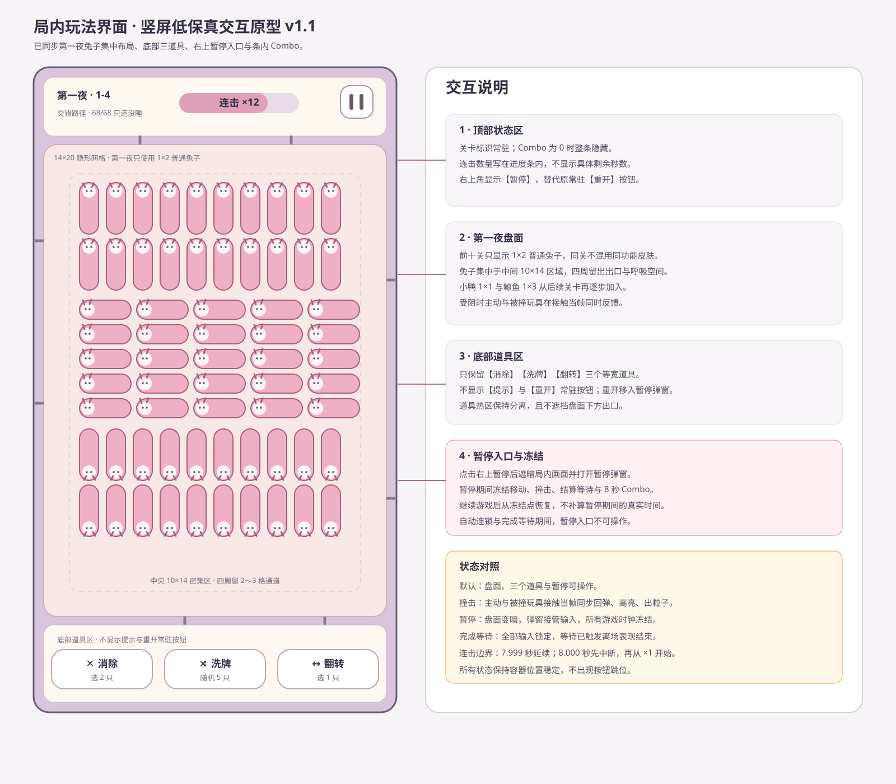
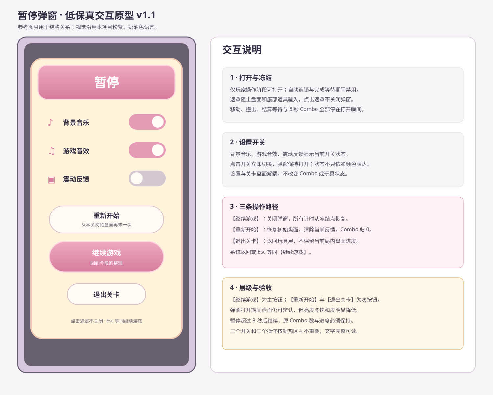
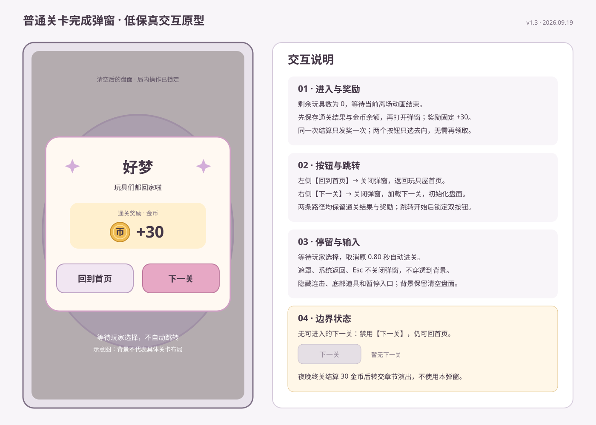
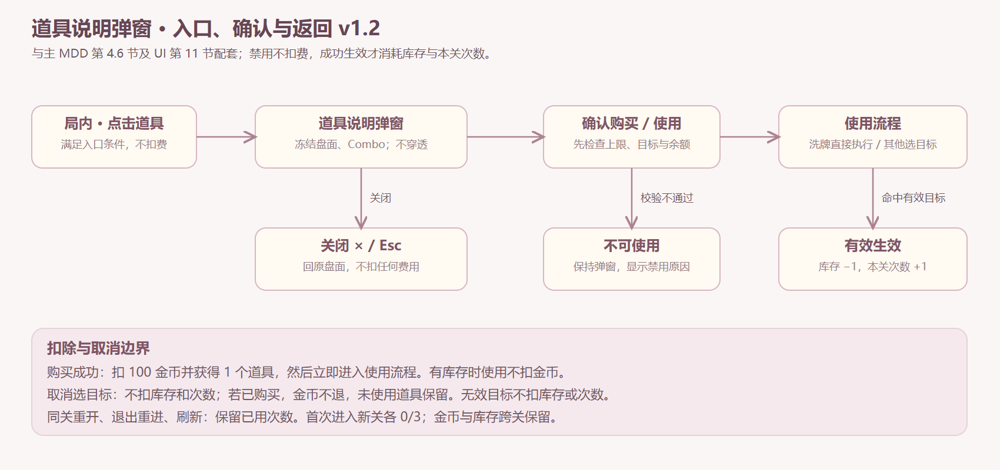

# 《UI-核心玩法系统界面交互说明》

## 1. 文档基本信息

### 1.1 文档信息

| 项目 | 内容 |
| --- | --- |
| 文档版本 | v1.3（沿用原文件名） |
| 编写日期 | 2026.08.29 |
| 更新日期 | 2026.09.19 |
| 适用范围 | Android、iOS 竖屏 MVP |
| 参考分辨率 | 1080×1920 |
| 归属主文档 | [《核心玩法系统 MDD》v1.3](../00-主MDD/MDD-核心玩法系统.v1.0.md) |
| 交互规范 | 《AI 游戏 UI 规范与 UI 文档模版 v1.0》第 4 章 |
| 原型规范 | 《AI 游戏 UI 规范与 UI 文档模版 v1.0》第 6 章 |

### 1.2 修订记录

| 版本号 | 编写日期 | 修改人 | 变更记录 |
| --- | --- | --- | --- |
| v1.0 | 2026.08.29 | Codex | 新增局内玩法、重开确认与普通关卡完成交互说明 |
| v1.1 | 2026.08.31 | Codex | 移除提示与重开常驻按钮；新增右上暂停入口及暂停弹窗 |
| v1.2 | 2026.09.16 | Codex | 同步 v5 视觉修订、取消飘字、单行关卡标题及道具说明/购买/使用/限次流程 |
| v1.2 补图 | 2026.09.16 | Codex | 补齐三种道具说明原型、三类禁用状态及入口/确认/返回流程图；提供 SVG 源图与 PNG 预览 |

| v1.3 | 2026.09.19 | Codex | 完成奖励显示金币 +30；完成浮层改为带回到首页、下一关按钮的弹窗；取消自动进关并同步验收 |

本版正文为当前交互口径；普通关卡完成弹窗 SVG 已同步 v1.3，其余历史 SVG、效果图与数值工作簿尚未重制，旧图中的提示气泡、条下文字、旧道具流程及无按钮自动进关流程不得覆盖本版规则。v1.3 为文档需求更新，运行时待实现验收。

---

## 2. 文档概述

### 2.1 覆盖范围

- 覆盖界面：局内玩法主界面；
- 覆盖弹窗：暂停弹窗、道具说明弹窗、普通关卡完成弹窗；
- 覆盖同屏状态：道具目标选中、小鸭自动连锁输入锁定、受阻撞击反馈、连击进度条；取消局内飘字。

### 2.2 不做内容

- 不包含美术风格、资源导出和程序实现方案；
- 不定义关卡选择、关卡布局与夜晚终关演出；
- 不展开第一夜教学步骤，只定义局内界面如何承载引导强调；
- 不包含数值与经济明细；正式值和测试值以主 MDD 与数值工作簿为准。

### 2.3 相关文档引用

| 文档名称 | 类型 | 版本 | 用途 | 链接 |
| --- | --- | --- | --- | --- |
| 《核心玩法系统 MDD》 | 主 MDD | v1.3 | 业务规则唯一来源 | [打开](../00-主MDD/MDD-核心玩法系统.v1.0.md) |
| 《配置-核心玩法系统-主模块-配置表设计说明》 | 配置设计 | v1.2 | UI 配置引用 | [打开](../cfg/_main/配置-核心玩法系统-主模块-配置表设计说明.v1.0.md) |

---

## 3. 界面清单与跳转关系

### 3.1 界面形态声明

- 局内玩法主界面：新增独立界面；
- 暂停弹窗、道具说明弹窗：局内玩法界面的模态弹窗；
- 普通关卡完成弹窗：局内玩法界面的模态弹窗，展示奖励并提供两条去向；
- 提示、自动连锁、撞击、连击：不新开界面，复用局内玩法界面表达状态。

### 3.2 界面清单

| 界面或弹窗 | 类型 | 主任务 | 用途摘要 |
| --- | --- | --- | --- |
| 局内玩法主界面 | 新增 | 观察并点击可离场的兔子或鲸鱼，逐步清空盘面 | 展示盘面、连击、三个道具和暂停入口 |
| 道具说明弹窗 | 新增弹窗 | 查看用途、购买或使用道具 | 展示库存、已用次数与操作按钮；冻结局内时间 |
| 暂停弹窗 | 新增弹窗 | 暂停游戏并集中承载设置与局内流程操作 | 调整音乐、音效、震动，或继续、重开、退出 |
| 普通关卡完成弹窗 | 新增弹窗 | 展示通关奖励并选择去向 | 显示“好梦”、金币 +30、回到首页及下一关 |
| 夜晚终关演出 | 外部复用 | 承接章节完成 | 归属章节系统，不在本文档展开 |

### 3.3 界面关系

1. 从玩具屋或章节流程进入关卡加载，盘面展示与开局小鸭逻辑结算完成后进入局内玩法主界面。
2. 点击右上角【暂停】打开暂停弹窗；弹窗打开期间游戏时间、移动、反馈、结算等待与连击倒计时全部冻结。
3. 暂停弹窗内可切换音乐、音效和震动，或选择【重新开始】【继续游戏】【退出关卡】。
4. 普通关卡清空且离场动画结束后，结算 30 金币并打开完成弹窗；点击【回到首页】返回玩具屋首页，点击【下一关】加载下一关。
5. 夜晚终关清空且离场动画结束后，结算 30 金币，再转交章节系统的完整晚安演出，演出结束返回玩具屋；不重复发放通关奖励。
6. 点击底部道具进入说明弹窗；确认后直接洗牌或进入目标选择，关闭返回原盘面。完整购买、禁用和返回路径见第 11 节。

---

## 4. 局内玩法主界面

### 4.1 原型图

### 4.2 界面用途与入口、退出

- 主任务：观察高密度盘面，点击可离场的兔子或鲸鱼，最终清空全部玩具。
- 入口：完成关卡加载、盘面展示和开局小鸭逻辑结算后进入可操作状态。
- 退出：普通关卡完成后进入下一关；夜晚终关完成后进入章节演出。
- 默认展示：完整盘面、关卡标识、右上角【暂停】与底部【消除】【洗牌】【翻转】；连击为 0 时不显示连击进度条。

### 4.3 界面结构分区

- 布局方向：竖屏，参考分辨率 1080×1920。
1. 顶部状态区：位于安全区内，显示关卡标识与连击进度条，右上角放置【暂停】。
2. 核心盘面区：位于顶部状态区与底部辅助区之间；完整显示四周出口，不放置会被误认作玩具的装饰。
3. 底部道具区：仅放置【消除】【洗牌】【翻转】三个道具；不再显示提示与重开按钮，不遮挡盘面底部出口。
4. 反馈层：承载选中高亮、勾选、撞击粒子和关卡完成反馈；不显示受阻、滑动、连锁、道具或重开飘字。

原型评审尺寸：顶部状态区高 176 像素、底部辅助区高 176 像素，盘面区使用中间剩余空间；以上尺寸需结合异形屏安全区做等比内缩。

### 4.4 交互元素规则

#### 4.4.1 盘面玩具

- 控件类型：核心玩法交互对象。
- 显示：按关卡数据展示兔子、小鸭、鲸鱼及当关皮肤；不显示格线。圆形地毯等比显示；兔子放大以提高识别度，去除长方形外框和方向箭头，坐姿素材按耳朵所指旋转到前进方向，不使用侧躺造型。视觉调整不改变逻辑占格。
- 可点击：仅待机状态的兔子与鲸鱼可点击；小鸭不可点击。
- 点击：按主 MDD 的直线路径、受阻和离场规则处理。
- 不可点击：移动、离场、受阻反馈中的同一玩具不接受重复点击；小鸭自动连锁期间全部玩具不接受点击。
- 点击失败反馈：不可点击状态下不产生新的移动或重复音效；自动连锁通过移动和输入锁定表达，不显示“小鸭正在回家”等提示文案。
- 点击热区：视觉轮廓外扩 12 像素 `[测试数据]`，但不得与相邻玩具热区产生无法判断的重叠；重叠时以触点覆盖面积最大的玩具为目标 `[测试数据]`。

#### 4.4.2 连击进度条

- 控件类型：只读状态控件。
- 显示条件：连击数大于 0；隐藏条件：连击归 0或离开局内界面。
- 显示内容：连击数量与进度条同组展示，填充统一粉色，不出现粉金两段；不显示具体剩余秒数和“待归位 70/72”。
- 状态变化：每次有效离场后立即回满；随后按 8 秒线性缩短。
- 中断：倒计时归零时立即隐藏；恰好 8.000 秒的有效离场视为原连击已中断，再以“连击 ×1”重新显示。
- 布局：顶部状态区居中；不得与关卡标题和暂停按钮重叠。

#### 4.4.3 【暂停】

- 控件类型：双竖线图标按钮。
- 显示条件：局内玩法主界面常驻显示。
- 可点击条件：处于玩家操作阶段。
- 禁用条件：小鸭自动连锁、道具说明弹窗、关卡完成等待、完成弹窗显示期间。
- 点击：打开暂停弹窗，冻结游戏时间并停止接收盘面与道具输入。
- 禁用反馈：不响应点击，不产生局内飘字。
- 布局：画面右上角安全区内，点击热区不小于 96×96 像素 `[测试数据]`。

#### 4.4.4 关卡标题、金币与底部道具

- 标题单行显示“第01关·月光敲敲窗”，编号至少两位并补零，中点连接名称；不显示第二行夜晚/关卡号。字体保持温馨可爱，长标题适配可用宽度。
- 金币栏显示实际余额；尚未接入的其他货币与加号入口保持不可用。
- 底部三个道具角标显示实际库存，初始均为 0；取消“选2只”“随机5只”“选1只”副文案。
- 点击道具只打开第 11 节说明弹窗；移动/离场动画期间不打开，不以快捷键绕过确认。

### 4.5 引导与选中反馈

- 不新增常驻提示按钮，也不恢复气泡或飘字；本轮不新增关卡教学编排。
- 道具目标通过轮廓高亮与勾选反馈，取消选择后清除。
- 本系统不使用红点；道具角标是库存数字，不是本关剩余次数。

### 4.6 状态展示

| 状态 | 界面表现 | 盘面 | 底部道具 | 暂停 |
| --- | --- | --- | --- | --- |
| 默认 | 显示关卡标识；连击按条件显示 | 可点击待机兔子、鲸鱼 | 可用 | 可用 |
| 自动连锁 | 小鸭路径动画与输入锁定，无提示文案 | 锁定 | 禁用 | 禁用 |
| 撞击反馈 | 接触位置播放同步回弹、高亮和粒子 | 其他待机玩具仍可操作 | 可用 | 可用 |
| 道具说明 | 全屏暗色遮罩、用途与购买/使用按钮 | 冻结且不可点 | 弹窗接管输入 | 禁用 |
| 暂停 | 全屏暗色遮罩与暂停弹窗 | 冻结且不可点 | 隐藏于遮罩下 | 弹窗接管输入 |
| 完成等待 | 不再接受输入，等待已触发离场表现结束 | 锁定 | 禁用 | 禁用 |

状态区分同时使用透明度、描边、图标或文案，不只依赖颜色。

### 4.7 动效与音效节奏

- 点击玩具：触点出现短促按压或高亮反馈，响应目标不晚于触点按下后的首个显示帧。
- 撞击：接触当帧主动与被撞玩具同时回弹、高亮并出现粒子；反馈时长 0.18 秒 `[测试数据]`。
- 有效离场：普通玩具离场 0.4～0.8 秒；小鸭沿路径移动，可与其他小鸭并行。
- 连击刷新：进度条立即回满，数字轻微放大后恢复；缩放时长 0.16 秒 `[测试数据]`。
- 道具选中：用轮廓高亮与勾选表达，不出现临时文字。
- 所有 UI 动效不改变控件布局，音效受设置系统控制。

### 4.8 测试用例

| 用例编号 | 用例标题 | 前置条件 | 步骤 | 期望结果 |
| --- | --- | --- | --- | --- |
| UI-PLAY-001 | 进入局内默认状态 | 关卡已加载；开局无可自动离场小鸭 | 观察界面 | 盘面完整；关卡标识、三个道具与右上暂停可见；提示和重开常驻按钮不存在；连击条隐藏 |
| UI-PLAY-002 | 开局小鸭自动结算期间锁定输入 | 开局存在可离场小鸭 | 盘面展示后点击玩具、道具和暂停 | 三类输入均不生效；没有飘字 |
| UI-PLAY-003 | 自动结算结束恢复输入 | 小鸭逻辑连锁即将结束 | 连锁结束后点击待机兔子 | 兔子立即按规则移动；按钮恢复可用 |
| UI-PLAY-004 | 常驻按钮精简 | 进入玩家操作阶段 | 观察底部与顶部 | 底部只显示消除、洗牌、翻转；提示和重开按钮不存在；右上角显示暂停 |
| UI-PLAY-005 | 三个道具保持可操作 | 处于玩家操作阶段 | 分别选择三个道具 | 分别打开说明弹窗；不直接使用或扣费；热区不互相重叠 |
| UI-PLAY-006 | 受阻双方即时反馈 | 兔子前方存在阻挡玩具 | 点击兔子并等待接触 | 接触当帧双方同时回弹、高亮并出现粒子 |
| UI-PLAY-007 | 受阻反馈不锁其他玩具 | 另有一只待机兔子 | 撞击反馈播放时点击另一只兔子 | 第二只兔子正常响应；若触发小鸭连锁则切换为锁定 |
| UI-PLAY-008 | 首次离场显示连击 | 连击为0 | 使一只玩具有效离场 | 顶部出现进度条；组件内显示连击数量 1，进度填充全粉色；无秒数及待归位小字 |
| UI-PLAY-009 | 连击有效刷新 | 距上次离场7.999秒 | 使下一只玩具有效离场 | 原连击延续；数量加1；进度条回满 |
| UI-PLAY-010 | 连击8秒边界中断 | 距上次离场恰好8.000秒 | 使下一只玩具有效离场 | 原连击中断；当前玩具开启“连击 ×1” |
| UI-PLAY-011 | 连击归零隐藏 | 连击已显示 | 8秒内不发生有效离场 | 连击归0；进度条隐藏 |
| UI-PLAY-012 | 多只小鸭分别增加连击 | 同一轮有3只小鸭可离场 | 触发该轮自动结算 | 连击依次增加3次；动画可并行；连击组件显示最终数量 |
| UI-PLAY-013 | 异形屏安全区 | 使用含刘海、圆角或底部手势区的设备 | 进入关卡 | HUD 位于安全区；盘面出口和按钮热区不被裁切 |

---

## 5. 暂停弹窗

### 5.1 原型图

参考暂停界面的结构关系制作；沿用本项目的粉紫、奶油色视觉语言，不照搬参考游戏资源。

### 5.2 用途与入口、退出

- 主任务：暂停当前局内进程，并集中承载设置与关卡流程操作。
- 入口：玩家操作阶段点击右上角【暂停】。
- 退出：点击【继续游戏】返回原盘面；点击【重新开始】恢复初始盘面；点击【退出关卡】返回玩具屋。
- 默认展示：背景盘面降低明度；音乐、音效、震动开关显示当前状态。

### 5.3 结构分区

1. 遮罩区：覆盖局内画面，阻止盘面点击。
2. 标题区：标题“暂停”。
3. 设置区：背景音乐、游戏音效、震动反馈三个开关。
4. 操作区：【重新开始】【继续游戏】【退出关卡】纵向排列；【继续游戏】使用主按钮层级。

### 5.4 交互元素规则

- 三个设置开关点击后立即切换并保留弹窗。
- 【继续游戏】关闭弹窗，恢复游戏时间、移动、反馈、结算等待与连击倒计时。
- 【重新开始】关闭弹窗，恢复初始布局，连击归0，再执行开局逻辑。
- 【退出关卡】关闭弹窗并返回玩具屋，不保留本关盘面进度。
- 遮罩
  - 点击遮罩不关闭弹窗，避免误触。
- 系统返回操作或 `Esc`
  - 等同点击【继续游戏】。

### 5.5 状态展示

- 默认：设置开关与三个操作按钮可用。
- 暂停期间：游戏内所有时钟冻结，Combo 进度条维持打开瞬间的长度与数量。
- 继续后：所有时钟从冻结点继续；不补算暂停期间的真实时间。

### 5.6 测试用例

| 用例编号 | 用例标题 | 前置条件 | 步骤 | 期望结果 |
| --- | --- | --- | --- | --- |
| UI-PAUSE-001 | 打开暂停弹窗 | 处于玩家操作阶段 | 点击右上角【暂停】 | 弹窗打开；背景变暗；盘面与底部道具不可点 |
| UI-PAUSE-002 | 暂停冻结游戏时间 | Combo 进行中且有移动或反馈 | 打开暂停并等待超过8秒 | 移动、反馈与 Combo 均停在打开瞬间，不发生超时断连 |
| UI-PAUSE-003 | 继续保持盘面 | 弹窗已打开 | 点击【继续游戏】 | 返回原盘面；位置不变；所有时钟从冻结点继续 |
| UI-PAUSE-004 | 重新开始 | 当前盘面已发生变化 | 点击【重新开始】 | 恢复初始布局；连击归0；重新执行开局逻辑；金币、库存及本关已用次数保持 |
| UI-PAUSE-005 | 退出关卡 | 弹窗已打开 | 点击【退出关卡】 | 返回玩具屋；不触发盘面操作 |

---

## 6. 普通关卡完成弹窗

### 6.1 原型图

[查看 SVG 源图](../assets/普通关卡完成反馈-交互原型.svg)。已同步金币 +30、回到首页、下一关和无下一关禁用状态；沿用原文件名保持引用有效。

### 6.2 用途与入口、退出

- 主任务：告知本关完成、展示 30 金币奖励，让玩家选择回首页或继续下一关。
- 入口：剩余玩具数为 0，离场动画结束，通关结果和奖励保存完成后打开。
- 退出：点击【回到首页】返回玩具屋首页；点击【下一关】加载下一关。不定时自动跳转。
- 默认展示：清空后的盘面作为背景，弹窗显示“好梦”、金币图标、“+30”和两个按钮；金币余额同步为发奖后的余额。
- 奖励以主 MDD 第 4.8.0 节为准；按钮只选择去向，不承担领取操作。

### 6.3 结构分区与规则

1. 背景区：保留清空后的局内场景并遮暗，阻止盘面、道具及暂停操作；连击进度条退出，不参与结算。
2. 标题区：显示“好梦”，可保留少量星光。奖励区独立展示金币图标与“+30”。
3. 操作区：底部并排放置左侧【回到首页】、右侧【下一关】；下一关为主按钮，回到首页为次按钮，热区不重叠并位于安全区内。
4. 【回到首页】关闭弹窗并返回玩具屋首页；【下一关】关闭弹窗并加载下一关，按新关初始化盘面与连击。两种操作均保留通关结果及奖励。
5. 弹窗保持显示直到玩家选择；点击遮罩、系统返回或 Esc 不关闭、不穿透盘面。
6. 任一跳转开始后同时禁用两个按钮，防止重复跳转或发奖。没有可进入的下一关时，【下一关】禁用，显示“暂无下一关”，仍可回首页。
7. 夜晚终关仍在结算 30 金币后转交章节系统，本节普通完成弹窗不替代完整晚安演出。

### 6.4 测试用例

| 用例编号 | 用例标题 | 前置条件 | 步骤 | 期望结果 |
| --- | --- | --- | --- | --- |
| UI-CLEAR-001 | 通关奖励与完成弹窗 | 普通关卡最后一只玩具离场；余额 C | 等待离场动画结束 | 余额 C+30；弹窗显示“好梦”、金币 +30、回到首页及下一关 |
| UI-CLEAR-002 | 完成状态锁定输入 | 完成反馈显示中 | 点击盘面、底部道具和暂停位置 | 所有操作不生效；不出现额外提示 |
| UI-CLEAR-003 | 等待玩家选择 | 完成弹窗已显示 | 等待超过旧 0.80 秒停留时间 | 弹窗仍显示，不自动跳转 |
| UI-CLEAR-004 | 夜晚终关奖励与去向 | 当前为夜晚终关 | 清空并等待离场动画结束 | 加 30 金币一次，再转交章节系统晚安演出 |
| UI-CLEAR-005 | 回到首页 | 完成弹窗已显示 | 点击【回到首页】 | 返回玩具屋首页，通关结果与奖励保留 |
| UI-CLEAR-006 | 下一关 | 完成弹窗已显示且存在下一关 | 点击【下一关】 | 只加载一次下一关，保留奖励，按新关初始化盘面与连击 |
| UI-CLEAR-007 | 防重复结算与跳转 | 已完成通关结算 | 重复回调、恢复已结算结果、快速连续点按钮 | 同一次结算只加 30 金币，一次操作只执行一条跳转 |
| UI-CLEAR-008 | 无下一关 | 没有可进入的下一关 | 点击下一关，再点回到首页 | 下一关禁用且显示“暂无下一关”；可正常回首页 |
| UI-CLEAR-009 | 未通关不发奖 | 盘面仍有玩具 | 暂停后退出或重开 | 不发通关奖励，不显示完成弹窗 |
| UI-CLEAR-010 | 遮罩与系统返回 | 完成弹窗已显示 | 点击遮罩，按系统返回或 Esc | 弹窗保持，背景无操作，不重复加币 |

---

## 7. 原型与图稿引用清单

| 文件用途 | 文件名 | 格式 | 链接 |
| --- | --- | --- | --- |
| 界面关系 | 核心玩法系统-界面关系评审稿.svg | SVG | [打开](../assets/核心玩法系统-界面关系评审稿.svg) |
| 局内玩法 | 局内玩法界面-交互原型.svg | SVG | [打开](../assets/局内玩法界面-交互原型.svg) |
| 暂停弹窗 | 暂停弹窗-交互原型.svg | SVG | [打开](../assets/暂停弹窗-交互原型.svg) |
| 普通完成 | 普通关卡完成反馈-交互原型.svg | SVG | [打开](../assets/普通关卡完成反馈-交互原型.svg) |
| 高保真概念图 | 核心玩法界面-高保真概念图.png | PNG | [打开](../assets/核心玩法界面-高保真概念图.png) |
| 道具说明与禁用状态 | 道具说明弹窗-交互原型.svg | SVG / PNG | [源图](../assets/道具说明弹窗-交互原型.svg) · [预览](../assets/道具说明弹窗-交互原型.png) |
| 道具操作流程 | 道具说明弹窗-流程图.svg | SVG / PNG | [源图](../assets/道具说明弹窗-流程图.svg) · [预览](../assets/道具说明弹窗-流程图.png) |

---

## 8. 外置文档协作规则

1. 玩法结果、计数、时间边界和输入锁定范围以主 MDD 为唯一规则源。
2. 本 UI 文档只维护界面结构、控件状态、操作反馈与 UI 测试用例，不重写玩法判定。
3. 配置字段与默认值以配置设计说明和数值工作簿为唯一来源；UI 只引用显示结果。
4. 修改界面名称、按钮名称或跳转路径时，同步更新本文流程与测试用例；本次保留的旧 SVG 已标为历史附件，后续重制时须按本版补齐道具弹窗路径及完成弹窗双按钮分支。

---

## 9. 后续迭代清单

- 实机可读性验证
  - 验证不同尺寸手机上的玩具点击热区、HUD 安全区和四周出口可见性。
  - 影响范围：局内玩法原型、控件布局、热区测试用例。
- 连击表现分级
  - 若后续确认不同连击档位的视觉与音效层级，新增表现配置并更新 UI 状态。
  - 影响范围：连击进度条、反馈配置、数值工作簿。
- 夜晚终关衔接
  - 章节系统 MDD 完成后，补充终关完成到晚安演出的正式界面引用。
  - 影响范围：界面关系图、外部系统引用。

---

## 10. 附录：SVG 源文件交付说明

本文档引用的全部 SVG 已作为独立文件落盘在 `../assets/`。每份 SVG 均包含界面主任务、关键控件、点击或返回关系、状态说明与不重叠的标注区；文件路径与第 7 章引用一致。

## 11. 道具说明弹窗（v1.2）

### 11.1 入口与结构

[查看可编辑 SVG 原型](../assets/道具说明弹窗-交互原型.svg)。原型展示消除购买、洗牌使用、翻转使用，以及金币不足、次数用尽、无有效目标三类禁用状态；图中余额和库存仅为状态示例，不是初始赠送。插图复用当前项目资源清单，背景仅作结构示意，不作为关卡布局。

点击底部【消除】【洗牌】【翻转】进入对应说明，背景遮暗并冻结游戏及 Combo，所有点击由弹窗接管。

从上到下为：道具标题与独立关闭按钮、道具示意图、用途说明、库存、本关已用 n / 3 次、弹窗下方主操作按钮。沿用项目 v5 的粉色、奶油、蝴蝶结及兔子资源；用户参考图只作为结构参考，不引入猪猪、视频或分享按钮。

| 道具 | 用途正文 |
| --- | --- |
| 消除 | 指定移除 2 只玩具 |
| 洗牌 | 随机将 5 只玩具转向 |
| 翻转 | 指定 1 只玩具反转方向 |

### 11.2 按钮状态与返回路径

| 条件 | 主按钮显示 | 操作结果 |
| --- | --- | --- |
| 库存 ≥1，未达上限，有有效目标 | 使用 | 消耗库存；消除/翻转先进入选目标，洗牌直接执行 |
| 库存 0，金币 ≥100，未达上限，有有效目标 | 购买＋金币图标＋100 | 扣币购买后直接进入使用流程，无二次确认 |
| 库存 0，金币不足 | 购买＋金币图标＋100，禁用 | 弹窗内显示“金币不足”，不扣费 |
| 对应道具本关已用 3 次 | 按库存显示购买或使用，禁用 | 弹窗内显示“本关使用次数已达上限” |
| 没有有效目标 | 按库存显示购买或使用，禁用 | 弹窗内显示“当前没有可使用的目标” |

禁用原因优先级：次数上限 ＞ 无有效目标 ＞ 金币不足。库存角标、余额和次数在购买/使用/发奖后刷新。购买、库存扣除、取消与保存细节以主 MDD 第 4.6 节为准。

点击关闭按钮或 Esc 返回原盘面，不扣费；点击外部遮罩不关闭。Enter/空格等同点击主操作按钮，仍须经过相同的条件校验。选目标期间 Esc、打开暂停或重新打开道具说明取消未完成的选择；购买已经成功的道具保留。

### 11.3 操作流程图

[查看可编辑 SVG 流程图](../assets/道具说明弹窗-流程图.svg)。

局内道具入口 → 说明弹窗 → 关闭：回原盘面；或确认购买/使用 → 洗牌立即生效 / 消除、翻转选目标 → 有效生效后扣库存和次数 → 回局内操作。禁用状态留在弹窗，不扣任何费用。

### 11.4 验收用例

| 编号 | 场景 | 期望 |
| --- | --- | --- |
| UI-TOOL-001 | 新玩家查看三种道具 | 各库存 0、各已用 0/3；购买按钮带金币图标和 100 |
| UI-TOOL-002 | 余额 99 / 100，库存 0 | 99 禁用；100 可购买，余额变 0 后直接进入使用流程 |
| UI-TOOL-003 | 库存 ≥1 | 显示使用；成功生效扣 1 库存和 1 次机会，不扣金币 |
| UI-TOOL-004 | 各道具用至第 3 次再打开 | 本关该道具禁用，其他道具独立计数；有库存仍不能突破 |
| UI-TOOL-005 | 关闭、点遮罩、点弹窗下的棋盘 | 关闭不扣费；遮罩不关闭；点击不穿透 |
| UI-TOOL-006 | Combo 中打开弹窗并等待超过 8 秒 | 时间冻结，关闭后从冻结点恢复 |
| UI-TOOL-007 | 购买后取消目标 / 点击小鸭翻转 | 已购买物保留；不扣库存和次数；无飘字 |
| UI-TOOL-008 | 重开、退出重进、刷新、新关 | 同关次数和背包保存；首次进入新关各 0/3 |
| UI-TOOL-009 | 手机竖屏 | 标题、图示、正文、库存、次数、关闭及主按钮完整可见 |
| UI-TOOL-010 | 次数已满后再获奖励 / 重复回调 | 库存可增加但本关仍禁用；重复回调不重复发奖 |
| UI-PLAY-014 | 观察盘面、连击与标题 | 圆毯、放大兔子耳朵指向前进方向，无外框/箭头；全粉连击、无飘字及已删除小字；单行“第01关·月光敲敲窗” |
