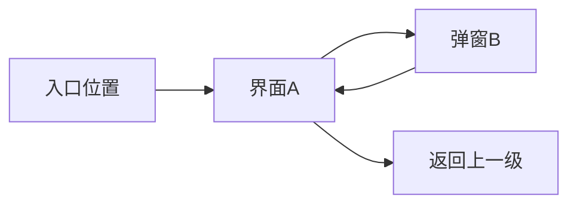

# AI 游戏 UI 规范与 UI 文档模版 v1.0（《UI-…系统界面交互说明》）

## 0. 文档定位与使用说明

### 0.1 文档定位

本规范是一个一体化模板，统一承担以下三类用途：

1. 约束 AI 生成**游戏 UI 方案**时的交互合理性。
2. 规范 AI 输出**《UI-…系统界面交互说明》**的文档结构与写法。
3. 规范 AI 同步输出**SVG / 低保真交互原型**的交付要求。

### 0.2 适用范围

适用于各类游戏界面，包括但不限于：

- 主界面
- 系统入口页
- 章节列表
- 关卡列表
- 养成页
- 背包页
- 商店页
- 活动页
- 任务页
- 详情页
- 弹窗
- 结算页
- 筛选页
- 配置页
- 关卡内 HUD
- 战斗内面板
- 编辑器界面
- 复用浮层与复用区域

本规范为通用规范，不限定具体玩法类型。

### 0.3 输出目标

本规范用于减少以下常见问题：

1. 主按钮不明确，页面主次不清。
2. 信息展示区与操作区混在一起，玩家先操作后理解。
3. 高频操作位置反人类，低频操作抢占黄金位置。
4. 按钮过小、过密、过于靠边，容易误触。
5. 危险操作与普通操作距离过近。
6. 状态表达混乱，玩家不知道能不能点、为什么不能点、点了会怎样。
7. 同类页面布局规则不一致，学习成本高。
8. AI 生成的页面“看起来像 UI”，但实际不适合落地。

---

## 1. AI 元指令（仅用于指导 AI，不进入最终 UI 文档正文）

**[AI_META_INSTRUCTION_START]**

AI 注意：以下所有以 `[AI_GUIDE_START]... [AI_GUIDE_END]`、`[AI_PROMPT_USER: ... ]`、`[AI_EXAMPLE_OUTPUT: ... ]` 开头的标记，均为指导 AI 行为的元指令，**不应出现在最终生成的具体 UI 文档中**。最终文档应是纯净的界面设计内容，包括但不限于：界面清单、结构分区、逐控件交互规则、状态展示、图稿引用、相对路径链接、测试用例、SVG 交付物。

### 强制要求

1. 《通用交互规范》用于约束所有类型界面的布局、按钮、状态、信息分层与交互合理性。
2. 《界面交互原型规范》仅用于指导生成 SVG / 草图，**不得出现在最终 UI 文档正文中**。
3. UI 文档必须与 SVG 交付物同步生成：每个界面至少 1 个 SVG；文档内必须引用对应相对路径；文档末尾必须输出 SVG 源文件（用于落盘）。
4. 禁止出现“待补充 / 略 / 因篇幅简化 / 详见后续”等空转表达；若信息不足，也必须输出占位 SVG 与占位规则，后续迭代再完善。
5. 最终 UI 文档必须同时满足：
   - 可读
   - 可查
   - 可执行
   - 可测试
   - 可落盘
6. 禁止为了“画面丰富”牺牲基础可用性；必须优先保证玩家看得懂、点得到、不误触、状态清晰、结构稳定。

**[AI_META_INSTRUCTION_END]**

---

## 2. 写作原则（UI 文档专用）

- **名词纯净化（强制）**：正文禁止括号英文、变量名、字段名、接口名等工程标识符。
- **不写技术实现（强制）**：不写“怎么请求 / 怎么调用 / 怎么埋点 / 怎么加字段”，只写“界面表现与交互规则”。
- **逐控件穷举（强制）**：界面内所有可交互控件必须逐项写清：显示 / 可点 / 点击 / 失败提示 / 状态变化。
- **相对路径引用（强制）**：所有文档与图稿引用必须使用相对路径链接。
- **不写美术风格**：本 UI 文档不包含美术风格、配色方案等，除非另行要求。
- **交付物闭环（强制）**：每个界面至少 1 个 SVG；文档引用路径必须存在；文档末尾必须输出 SVG 源文件。
- **测试用例必写（强制）**：每个界面必须包含一组“标题级可执行”测试用例。
- **主次清楚（强制）**：每个界面描述时，必须明确主任务、核心信息、主按钮、异常态，不得写成“控件堆料清单”。
- **状态口径统一（强制）**：文档内描述的状态展示，必须与本模板的通用交互规范保持一致，不允许同义状态多套写法并存。
- **先结构后控件（强制）**：逐界面说明必须先写结构分区，再写控件规则，避免控件脱离容器语境。

---

## 3. 文档路径与相对路径引用规范（强制）

**[AI_GUIDE_START]**

### 要写什么

- UI 文档所在目录与常见引用路径
- UI 文档引用主 MDD / 子模块设计文档 / 图稿的示例

### 怎么写

- 给出可复制的相对路径示例
- 不写实现内容

**[AI_GUIDE_END]**

- UI 文档目录：`docs/design/{模块名称}/ui/`
- 图稿目录：`docs/design/{模块名称}/assets/`
- 引用格式：`[显示名（带版本）](相对路径)`

常用引用示例（UI 文档位于 `.../{模块}/ui/`）：

```md
[《{模块名称} MDD》v1.2](../mdd/MDD-{模块名称}.v1.2.md)
[《{模块名称}-{子模块名称} 子模块设计文档》v1.0](../mdd/MDD-{模块名称}-{子模块名称}-子模块设计文档.v1.0.md)

```

---

## 4. 通用交互规范（所有界面强制遵循）

### 4.1 一个页面只围绕一个主任务设计

每个页面都必须先明确“主任务”是什么，例如：

- 开始挑战
- 确认领取
- 选择章节
- 升级角色
- 购买道具
- 查看并继续推进
- 筛选并进入目标内容

页面中所有信息层级、按钮权重、布局焦点，都必须服务于这个主任务。

#### 禁止情况

- 一个页面同时承载多个同级目标
- 玩家第一眼看不出“这个页面最该做什么”
- 高价值操作和低价值操作抢同一个视觉层级

### 4.2 先看懂，再操作

所有页面默认遵循以下心智顺序：

**定位页面 → 理解信息 → 做出选择 → 执行操作**

因此，页面布局必须优先保证：

1. 玩家先知道当前页面是什么。
2. 玩家先知道当前状态如何。
3. 玩家先知道点击前需要知道的成本 / 收益 / 限制。
4. 然后再进行输入、选择和确认。

#### 禁止情况

- 一打开页面就先让玩家输入或点击
- 先做选择，后补规则说明
- 先让玩家确认，再在别处解释结果和代价

### 4.3 一个页面只能有一个真正的主按钮

同一页面只允许有一个最推荐点击的主操作。

常见主按钮示例：

- 开始
- 确认
- 领取
- 升级
- 保存
- 下一步
- 再来一次

#### 规范要求

1. 主按钮必须是页面最高视觉优先级。
2. 次按钮必须明显弱于主按钮。
3. 危险按钮必须独立隔离，不与主按钮贴邻。
4. 如果出现两个及以上同级大按钮，视为结构有问题。

### 4.4 颜色是语义，不是装饰

颜色优先承担“状态与优先级表达”的职责，而不是装饰。

颜色只应用于以下语义：

- 主操作
- 次操作
- 危险操作
- 已完成
- 可领取
- 警告提醒
- 禁用 / 不可用
- 选中 / 当前焦点

#### 禁止情况

- 一个页面里同时出现多个高饱和主按钮色
- 同一种颜色表达多个不同语义
- 只靠颜色区分状态，不辅以文字 / 图标 / 描边 / 透明度等方式

### 4.5 信息与操作必须分层

页面必须明确区分：

1. **导航区**
2. **核心信息区**
3. **输入 / 选择区**
4. **主操作区**

信息区必须先于输入区，输入区必须先于主操作区。

#### 禁止情况

- 信息、说明、按钮混在同一堆里
- 主按钮漂浮在中间内容区，没有明确操作容器
- 重要成本 / 收益 / 风险不在按钮附近

### 4.6 信息上屏判定规则（强制）

**[AI_GUIDE_START]**

#### 要写什么

- 明确“什么信息可以上屏，什么信息不应上屏”
- 明确“用户完成当前任务所必须知道的信息”才允许常驻展示
- 明确“系统内部判断过程、重复摘要、流程说明、已满足条件清单”等默认不上屏
- 明确“阻塞原因、失败原因、未满足条件”应优先做局部提示，而不是页面级大块说明
- 明确“摘要卡、状态卡、进度卡”的使用边界

#### 怎么写

- 从玩家视角判断信息是否需要展示，而不是从系统自我解释视角判断
- 以“是否帮助玩家完成当前任务”为唯一上屏标准
- 用规则句描述，避免抽象空话
- 不写技术实现，不写工程标识符

**[AI_GUIDE_END]**

界面中只展示“玩家完成当前任务所必须知道的信息”。  
不允许为了展示系统完整性、流程完整性或校验完整性，将玩家当前不需要知道的内部信息常驻放入界面。

#### 4.6.1 上屏总原则

1. 只有会直接影响玩家当前判断、当前选择或当前操作的信息，才允许上屏。
2. 玩家已能从当前界面直接感知的信息，不应再重复做摘要展示。
3. 系统自己知道的信息，不等于玩家需要看到的信息。
4. 信息是否上屏，优先判断“是否帮助玩家完成当前任务”，而不是判断“系统是否已经做了这一步校验”。
5. 同一页面中，信息越靠近当前操作点，优先级越高；越脱离当前操作点，越不应上屏。

---

#### 4.6.2 允许上屏的信息

以下信息可以上屏，但前提是它们会直接影响玩家当前操作：

1. 当前页面主任务说明  
   例：本页用于输入项目名称并确认立项

2. 当前操作必须依赖的状态信息  
   例：资源数量不足、未解锁、冷却中、已达上限

3. 当前按钮点击前必须知道的成本、收益、风险、限制  
   例：本次消耗、预计获得、不可逆结果、前置条件

4. 当前输入或选择后会立即影响决策的结果信息  
   例：预计工作量、预计评分变化、预计成功率

5. 当前唯一阻塞项或当前主要阻塞项  
   例：还需输入项目名称

6. 与当前选择直接相关的局部说明  
   例：团队槽位允许空槽立项；主类型至少选择1个

---

#### 4.6.3 默认不应上屏的信息

以下信息默认不得常驻展示，除非玩家当前操作必须依赖其判断：

1. 系统内部校验过程  
   例：已满足类型数量、题材数量、主类型存在

2. 已满足条件清单  
   例：类型 2/2、题材 2/3、团队 2/3

3. 流程阶段摘要或过程进度摘要  
   例：当前进度、流程完成度、当前立项口径

4. 规则解释性口径  
   例：当前允许空槽直接立项、系统当前按某口径判定可创建

5. 玩家已能从当前界面直接感知的信息的重复总结  
   例：左侧已经显示了已选类型、已选题材、团队成员，右侧再做“组合摘要”

6. 纯系统视角的状态总览  
   例：当前状态、当前阻塞、内部可创建条件说明

7. 与当前决策无直接关系的背景性说明  
   例：系统流程解释、设计口径说明、页面目标重复描述

---

#### 4.6.4 局部提示优先于全局说明

1. 阻塞原因应优先放在对应控件附近展示，不应默认提升为页面级说明卡。
2. 失败原因应优先在触发失败的按钮附近、输入框下方或相关模块内提示。
3. 未满足条件应优先与对应按钮、对应字段、对应模块绑定展示。
4. 只有当同一时刻存在多个并列阻塞项，且玩家无法从局部提示快速定位问题时，才允许做统一汇总提示。
5. 统一汇总提示也应尽量放在主操作区附近，而不是放在页面顶部抢占首屏注意力。

#### 示例

- “请输入项目名称”应放在项目名称输入框下方或确认按钮附近  
- “资源不足”应放在购买按钮或消耗说明附近  
- “未解锁”应放在锁定入口或锁定功能区附近  
- “冷却中”应放在对应按钮或对应条目附近  

---

#### 4.6.5 重复信息不得二次摘要展示

1. 若玩家已能从选中态直接看出已选内容，则不再额外生成“组合摘要”。
2. 若玩家已能从槽位直接看出团队配置情况，则不再额外生成“团队进度摘要”。
3. 若玩家已能从输入框和按钮状态直接理解当前阻塞项，则不再额外生成“当前状态卡”。
4. 若信息已通过当前结构自然表达，则禁止再用摘要卡、进度卡、状态卡重复说明。
5. 同一条信息在一个页面中原则上只表达一次；若必须重复，重复内容必须承担不同职责，而不是机械复述。

---

#### 4.6.6 阻塞原因展示规则

1. 阻塞原因只展示“当前最需要玩家处理的内容”，不展示系统完整校验明细。
2. 若存在多个阻塞项，应按优先级排序展示，不要全部平铺上屏。
3. 阻塞原因文案必须直接指向玩家下一步动作。  
   例：请输入项目名称、请选择主类型、请补充至少1名成员
4. 阻塞原因应写成“现在要做什么”，而不是“系统已经判定了什么”。  
   例：写“还需输入项目名称”，不要写“当前阻塞：项目名称为空”
5. 当阻塞项已解除，对应提示应立即消失或降级，不得长期残留。

---

#### 4.6.7 摘要卡、状态卡、进度卡使用限制

摘要卡、状态卡、进度卡仅在以下情况允许使用：

1. 玩家无法从当前主区域直接感知关键信息
2. 摘要信息会直接影响当前决策
3. 信息不便绑定到单一控件附近展示
4. 信息具有独立决策价值，而不是重复复述

以下情况禁止使用摘要卡、状态卡、进度卡：

1. 仅用于重复展示玩家已选内容
2. 仅用于展示系统已满足了哪些条件
3. 仅用于展示系统当前内部判断过程
4. 仅用于解释页面本身已经清楚表达的内容
5. 仅为了“页面看起来更完整”而补信息块

---

#### 4.6.8 页面目标与说明信息的限制

1. 页面标题已能表达页面目的时，不再额外增加“页面目标”信息块。
2. 页面副标题已能说明当前任务时，不再额外增加重复任务说明。
3. 说明信息只在玩家确实会因此降低理解成本时保留。
4. 说明文案优先短句，优先靠近相关模块，禁止写成大段说明卡占用首屏。
5. 所有说明信息都应接受“删除后是否影响玩家完成任务”的判断；若删除后不影响，则默认不上屏。

---

#### 4.6.9 信息上屏自检清单（强制）

在输出界面方案前，必须逐条自检：

1. 这条信息是否会直接影响玩家当前操作？
2. 这条信息是否是玩家点击前必须知道的？
3. 这条信息能否从当前选中态、槽位状态、按钮状态中直接感知？
4. 这条信息是否只是系统内部过程说明？
5. 这条信息是否只是对已有内容的重复摘要？
6. 这条信息是否更适合放在对应控件附近，而不是做成全局信息块？
7. 删除这条信息后，玩家是否仍能顺利完成当前任务？

若第 4、5、6、7 项中任意一项答案为“是”，则该信息默认不应常驻上屏。

---

#### 4.6.10 结论规则（强制记忆）

界面不是系统说明书。  
界面中不展示“系统知道什么”，只展示“玩家现在必须知道什么”。  
凡是不帮助玩家完成当前任务的信息，默认不上屏。

### 4.7 容器化布局，禁止漂浮摆放

所有内容必须位于清晰容器内，例如：

- 顶部导航容器
- 信息摘要容器
- 列表容器
- 筛选容器
- 主操作容器
- 提示容器
- 状态容器

#### 禁止情况

- 文字压在按钮上
- 图标压在标签上
- 内容超出容器边界
- 组件漂浮乱放，没有归属
- 空间不足时直接重叠或硬塞

### 4.8 状态必须清晰、稳定、可解释

所有页面至少应考虑以下状态中的适用项：

- 默认态
- 选中态
- 当前态
- 禁用态
- 未解锁态
- 资源不足态
- 冷却态
- 已完成态
- 可领取态
- 成功态
- 失败态
- 危险确认态

#### 规范要求

1. 状态不能只靠颜色区分。
2. 禁用态必须尽量说明原因。
3. 同一类状态在不同页面中应统一表现。
4. 同一页面不同状态下，布局尽量保持不跳动。

### 4.9 高频操作优先，低频功能让位

#### 规范要求

1. 高频操作放在最容易点击的位置。
2. 低频操作放顶部、二级入口或弱化区域。
3. 危险操作不要放在最容易误触的位置。
4. 复用页面时，也要优先保证主链路，而不是把所有入口全塞满。

### 4.10 点击必须有反馈，失败必须有原因

#### 规范要求

1. 点击、切换、领取、升级、购买、确认后，必须有即时反馈。
2. 反馈可通过高亮、文案变化、数值变化、提示、动效、角标变化等体现。
3. 点击失败时必须给出原因，且按优先级显示。

#### 禁止情况

- 点了没有反应
- 按钮灰显但不解释原因
- 失败提示顺序混乱
- 关键操作成功 / 失败后无明确结果反馈

---

## 5. 横屏 / 竖屏界面布局口径

### 5.1 竖屏界面规范

竖屏界面更适合：

- 单主流程
- 纵向信息阅读
- 自上而下决策
- 底部确认操作

#### 推荐结构

**顶部**
- 返回
- 标题
- 少量低频入口

**上半屏**
- 当前状态
- 目标
- 资源
- 进度
- 奖励预览
- 关键信息摘要

**中部**
- 页签
- 列表
- 卡片选择
- 输入项
- 筛选项

**底部**
- 主按钮
- 少量次按钮

#### 强制要求

1. 最重要信息必须尽量落在上半屏。
2. 最重要操作必须尽量落在底部主操作区。
3. 高频操作不应放在顶部。
4. 同一行不应堆叠过多同级高权重操作。
5. 竖屏布局优先纵向堆叠，不要强行做复杂多栏并排。

### 5.2 横屏界面规范

横屏界面更适合：

- 左右功能分区
- 信息与操作并行
- 中央主视觉保持完整
- 实时内容与侧边操作共存

#### 推荐结构

**左侧**
- 导航
- 页签
- 列表
- 筛选
- 信息摘要

**中间**
- 主内容区
- 角色 / 场景 / 棋盘 / 关卡预览 / 大图展示 / 战斗画面

**右侧或右下**
- 操作区
- 确认区
- 详情补充区

#### 强制要求

1. 优先采用左右分区，不要生硬套用竖屏整页纵向堆叠。
2. 中央主内容必须保持视野清晰，不被操作堆叠遮挡。
3. 信息区和操作区可分栏，但职责必须清晰。
4. 右侧操作区不应过度膨胀，挤占主视觉。
5. 如为战斗 / HUD 类横屏界面，中心主战场必须尽量干净。

---

## 6. 界面交互原型规范（强制遵循，仅指导 SVG / 草图）

**[AI_GUIDE_START]**

### 通用前缀提示词（界面交互图专用｜强制不重叠 / 不越界 / 滚动视窗正确表达）

你要生成的是【界面交互图 / 低保真线框稿】（标注为 xx×xx 分辨率）。**硬性要求：任何文字、图标、标签、按钮、底框不得与其他元素重叠；不得超出所属容器边界；不得出现“内容把底框撑出区域”的误导画法。** 请采用“**容器化布局 + 自适应排版 + 视窗化滚动表达**”，禁止固定坐标硬摆。

### 总体风格（强制）

1. 原型默认采用**低保真线框**：不画阴影、不做拟物、不做高保真配色；使用线框 / 灰度块 / 少量强调描边表达层级。
2. 原型必须以**容器化布局**表达结构：所有元素必须位于所属容器内，容器之间有明确间距与内边距。
3. 原型的页面布局必须先满足本模板第 4 章与第 5 章中的通用交互规范，再进行原型排布。

### 布局与排版（强制不重叠 / 不越界）

1. 任何文字、图标、标签、按钮、底框**不得与其他元素重叠**，不得超出所属容器边界。
2. 空间不足时优先采用：减少间距 / 降字号（但字号不得小于 14）/ 内部滚动视窗；**禁止**用固定坐标硬摆导致重叠或越界。
3. 不得出现“内容把底框撑出区域”的误导画法；内容超出容器时必须用“裁切 / 截断”体现。
4. 页面结构必须先满足“导航区 → 核心信息区 → 输入 / 选择区 → 主操作区”的逻辑；横屏可分栏，但职责必须清晰。

### 文本与标签表现（强制）

1. 文本单行默认使用省略号；多行文本允许自动换行但必须限行，超出以省略号结束。
2. 标签类内容采用“流式换行”的芯片布局；超出容器时采用“更多”或内部滚动视窗表达，禁止越界。
3. 公式 / 图标行必须使用独立容器，可折行显示，禁止压缩导致重叠。
4. 关键成本 / 收益 / 条件必须放在主按钮附近或按钮上方，不得藏在角落说明里。

### 可滚动区域的视窗化表达（强制）

1. 内容超出区域时，必须使用**视窗化滚动**：固定可视高度，超出部分以裁切 / 渐隐表达。
2. 默认**不画滚动条**，也不写“可上下拖动查看更多”的提示文字，除非明确要求。
3. 滚动区域内的元素同样必须遵守不重叠 / 不越界。
4. 必须看得出“哪一块会滚、哪一块固定”。

### 多状态一致性（强制）

1. 同一界面不同状态下，同一容器的**位置 / 尺寸 / 顺序尽量一致**，避免布局跳动；只替换内部内容（如按钮置灰、文案变化、列表空态）。
2. 状态差异必须通过明确的样式变化体现（置灰 / 锁定 / 选中 / 禁用 / 倒计时等），且不引发重叠。
3. 不允许因为状态变化导致主按钮乱跳、主信息区位置突变、操作路径改变。

### 交互说明要求（强制）

1. **SVG 必须包含交互说明**：点击、拖动滚动方向、选中态、禁用态、二次确认等。
2. **PNG 不需要写交互说明**（若输出 PNG）。
3. 交互说明需标注元素类型（背景、图片、图标、按钮、输入框、预制体等）与 UI 需求，且字号不得小于 14。

### 颜色与可读性（强制）

1. UI 图形必须有颜色，**不能纯白**；可用灰度块 + 少量强调描边体现重点。
2. 字号不得小于 14，保证可读性。
3. 主按钮、次按钮、危险按钮、禁用态、未解锁态需有明确视觉区分。

### 禁止项（强制）

1. 禁止任何重叠、越界、或用“画法假象”表达滚动（例如把内容画在容器外）。
2. 禁止在未声明滚动的情况下，把大量内容硬塞进同一容器导致拥挤与误读。
3. 若发现图片 / 文字重叠或越界，必须修正到满足上述规则为止。
4. 禁止一个页面出现多个同等权重主按钮。
5. 禁止信息区与输入区混排，禁止主按钮漂浮在说明文案中间。

**硬约束：原型规范仅用于指导生成 SVG / 草图，不得出现在最终 UI 文档正文中。**

**[AI_GUIDE_END]**

---

## 7. UI 文档模板正文

### 7.1 文档基本信息

#### 7.1.1 文档名称

**[AI_GUIDE_START]**

- 文档标题格式：`UI-{系统/子模块名称}系统界面交互说明`
- 系统 / 子模块名称必须与主 MDD 3.1 功能结构节点一致

**[AI_GUIDE_END]**

#### 示例

- 《UI-员工招聘系统界面交互说明》

#### 7.1.2 文档信息

**[AI_GUIDE_START]**

##### 要写什么

- 文档版本、适用范围
- 归属主 MDD 引用（必写）
- 若对应某子模块：归属子模块设计文档引用（必写）
- 声明：本 UI 文档输出的草图 / SVG 必须遵守本模板内置的原型规范
- 声明：本 UI 文档的交互规则必须遵守本模板第 4 章《通用交互规范》

##### 怎么写

- 全部使用相对路径链接
- 不写工程标识符

**[AI_GUIDE_END]**

- 文档版本：v1.0
- 适用范围：主干 / 分支（如有）
- 归属主文档：《{模块名称} MDD》v1.2
- 归属子模块文档（如适用）：《{模块名称}-{子模块名称} 子模块设计文档》v1.0
- 交互规范：必须遵守本模板第 4 章《通用交互规范》
- 原型规范：必须遵守本模板第 6 章《界面交互原型规范（内置版）》

#### 7.1.3 修订记录

| 版本号 | 编写日期   | 修改人 | 变更记录           |
| ------ | ---------- | ------ | ------------------ |
| v1.0   | YYYY.MM.DD | ______ | 新增一体化模板初版 |

---

### 7.2 文档概述

#### 7.2.1 覆盖范围（必写）

**[AI_GUIDE_START]**

- 列出本 UI 文档覆盖的界面 / 弹窗 / 复用区域清单
- 若复用其他系统界面：明确“复用界面名 + 本系统承担内容”

**[AI_GUIDE_END]**

- 覆盖界面：______
- 覆盖弹窗：______
- 复用界面区域：______（本系统承担：______）

#### 7.2.2 不做内容（必写）

**[AI_GUIDE_START]**

- 明确本文档不包含：美术风格、资源规范、实现细节、数值明细

**[AI_GUIDE_END]**

- 本文档不包含：美术风格规范、资源导出规范、程序实现方案、数值与经济明细。

#### 7.2.3 相关文档引用（必写）

**[AI_GUIDE_START]**

- 至少引用：主 MDD、对应子模块设计文档（如有）

**[AI_GUIDE_END]**

| 文档名称                                   | 类型           | 版本 | 用途     | 链接（相对路径）                                            |
| ------------------------------------------ | -------------- | ---- | -------- | ----------------------------------------------------------- |
| 《{模块名称} MDD》                         | 主MDD          | v1.2 | 口径来源 | `../mdd/MDD-{模块名称}.v1.2.md`                             |
| 《{模块名称}-{子模块名称} 子模块设计文档》 | 子模块设计文档 | v1.0 | 规则来源 | `../mdd/MDD-{模块名称}-{子模块名称}-子模块设计文档.v1.0.md` |

---

### 7.3 界面清单与跳转关系

#### 7.3.1 界面形态声明（必写）

**[AI_GUIDE_START]**

- 形态：新增独立界面 / 复用已有界面 / 无独立界面（可多选）
- 判定口径：不新开页面 = 复用界面

**[AI_GUIDE_END]**

- 界面形态：新增独立界面 / 复用已有界面 / 无独立界面

#### 7.3.2 界面清单（必写）

**[AI_GUIDE_START]**

- 列出所有界面与弹窗
- 复用界面：写清“归属模块 + 本系统承担内容”
- 建议补充：主任务摘要，确保界面清单不是纯名称罗列

**[AI_GUIDE_END]**

| 界面/弹窗名称 | 类型（新增/复用） | 归属模块（复用时必填） | 主任务摘要 | 用途摘要 |
| ------------- | ----------------- | ---------------------- | ---------- | -------- |
| ______        | 新增/复用         | ______                 | ______     | ______   |

#### 7.3.3 跳转关系（必写）

**[AI_GUIDE_START]**

- 用文字列出界面打开 / 关闭 / 返回关系
- 如关系复杂可附 Mermaid（仅表达界面跳转）
- 若为横屏 / 竖屏不同入口，也应写清入口差异

**[AI_GUIDE_END]**

- 入口：从【______】打开【界面A】
- 跳转：在【界面A】点击【______】打开【弹窗B】
- 退出：点击【关闭】返回【______】

（可选）



---

### 7.4 逐界面说明（核心章节｜逐控件穷举强制｜SVG先行强制）

> 每个界面必须包含：  
> 1）SVG 引用（必须存在）  
> 2）用途与入口 / 退出  
> 3）结构分区（容器化）  
> 4）逐控件交互规则（全量穷举）  
> 5）状态展示（适用项必写）  
> 6）二次确认（如有）  
> 7）动效 / 音效（如有）  
> 8）测试用例（必写）

#### 7.4.X 【界面名称】（每个界面一节，强制）

##### 7.4.X.1 原型图 / SVG 引用

**[AI_GUIDE_START]**

- 每个界面必须至少引用一个草图或 SVG
- SVG 文件内必须包含交互说明（点击 / 滚动 / 选中 / 禁用等），并符合第 6 章原型规范
- 这里必须给出真实可用的相对路径引用，禁止“待补充”
- 该 SVG 必须在文档末尾“附录 A：SVG 源文件（交付物）”中提供源文件内容

**[AI_GUIDE_END]**

原型引用：``

##### 7.4.X.2 界面用途与入口 / 退出

**[AI_GUIDE_START]**

- 写清入口来源、退出方式、返回目标界面
- 写清本界面主任务
- 写清默认展示的状态 / 页签 / 区域
- 不写实现动作

**[AI_GUIDE_END]**

- 主任务：______
- 入口：从【______】打开本界面
- 退出：点击【______】关闭，返回【______】
- 默认展示：进入后默认展示【______状态 / 页签 / 区域】

##### 7.4.X.3 界面结构分区

**[AI_GUIDE_START]**

- 用“区域名称 + 内容说明 + 规则摘要”描述
- 强制容器化表达；若存在滚动则按视窗化滚动表达
- 写清该界面为横屏还是竖屏布局
- 结构分区必须符合第 4 章《通用交互规范》

**[AI_GUIDE_END]**

- 布局方向：横屏 / 竖屏
1. 导航区：______
2. 核心信息区：______
3. 输入 / 选择区：______（是否滚动）
4. 主操作区：______
5. 提示区：______

##### 7.4.X.4 交互元素规则（逐控件穷举，强制）

**[AI_GUIDE_START]**

- 每个可交互控件都必须写：显示 / 可点 / 点击 / 失败提示优先级 / 状态变化
- 必须体现主按钮 / 次按钮 / 危险按钮层级
- 不写工程标识符与实现动作

**[AI_GUIDE_END]**

- 控件：______
  - 控件类型：主按钮 / 次按钮 / 危险按钮 / 页签 / 列表项 / 输入框 / 图标按钮 / 其他
  - 显示条件：______；隐藏条件：______
  - 可点击条件：______；灰显条件：______
  - 点击行为：______
  - 点击失败提示（优先级）：原因 A 提示“______” > 原因 B 提示“______” > 默认提示“______”
  - 状态变化：点击后变为______，文案变为______，角标变为______
  - 布局说明：位于【______区域】，与【______控件】的关系为______

（把界面内所有可交互控件逐条列完）

##### 7.4.X.5 红点 / 角标 / 气泡提示 / 引导（如有则必写）

**[AI_GUIDE_START]**

- 写“触发条件 → 表现 → 关闭条件”，多来源写优先级
- 红点：出现条件 → 表现 → 消失条件 → 优先级
- 引导：触发条件 → 表现 → 关闭条件

**[AI_GUIDE_END]**

示例：

- 红点
  - 触发条件：______
  - 表现：______
  - 消失条件：______
  - 优先级：______

- 引导
  - 触发条件：______
  - 表现：______
  - 关闭条件：______

##### 7.4.X.6 状态展示（空 / 满 / 锁定 / 不可用 / 异常，必写适用项）

**[AI_GUIDE_START]**

- 至少覆盖本界面会出现的状态：空状态、不可用、加载失败、配置缺失兜底等
- 每种状态写：界面显示、按钮状态、提示文案占位
- 状态描述必须与第 4 章《通用交互规范》一致
- 禁用态必须尽量说明原因

**[AI_GUIDE_END]**

示例：

- 空状态：显示______；按钮______；提示“______”
- 不可用：显示______；按钮灰显；提示“______”
- 未解锁：显示______；按钮______；提示“______”
- 资源不足：显示______；按钮______；提示“______”
- 请求失败：提示“______”，不写入关键进度
- 配置缺失兜底：显示默认提示“______”，并禁止相关操作

##### 7.4.X.7 二次确认弹窗（如有）

**[AI_GUIDE_START]**

- 场景 → 文案 → 确认行为 → 取消行为
- 若属于危险操作，必须明确后果与按钮层级

**[AI_GUIDE_END]**

示例：

场景：______

- 【文案】：“______”
- 【确认】：______
- 【取消】：______

##### 7.4.X.8 动效 / 音效节奏（如有）

**[AI_GUIDE_START]**

- 只写“在什么时机需要什么表现”，不写实现
- 只写与理解交互、强化反馈相关的必要表现

**[AI_GUIDE_END]**

示例：

- 当______成功时：播放______
- 当______可领取时：播放______
- 当______失败时：播放______

##### 7.4.X.9 测试用例（必写）

**[AI_GUIDE_START]**

###### 要写什么

- 为本界面输出一组“标题级可执行”测试用例，覆盖：
  1. 入口与退出
  2. 核心主流程（关键操作路径）
  3. 每个关键控件的可点 / 灰显 / 失败提示优先级
  4. 各类状态展示（空 / 锁定 / 不可用 / 异常）
  5. 二次确认弹窗（如有）
  6. 滚动视窗与列表项交互（如有）
  7. 主按钮位置与主次层级是否清晰
  8. 信息区是否先于输入区展示

- 用例必须与本界面的“逐控件交互规则（7.4.X.4）”和“状态展示（7.4.X.6）”一一对应，避免漏测。

###### 怎么写

- 不写实现、不写工程标识符、不写埋点。
- 用例写到“可执行程度”，每条包含：用例编号 / 用例标题 / 前置条件 / 步骤 / 期望结果。
- 每条用例尽量只测一个点；复杂流程拆成多条。

**[AI_GUIDE_END]**

###### 用例表（模板）

| 用例编号          | 用例标题                            | 前置条件                       | 步骤                              | 期望结果                                                     |
| ----------------- | ----------------------------------- | ------------------------------ | --------------------------------- | ------------------------------------------------------------ |
| UI-{界面简称}-001 | 入口打开界面成功                    | 玩家满足开启条件；入口可见可点 | 1）在【入口位置】点击【入口控件】 | 1）打开【界面名称】；2）默认展示【默认状态/默认页签】；3）关键区域可见且不重叠不越界 |
| UI-{界面简称}-002 | 关闭界面返回正确                    | 界面已打开                     | 1）点击【关闭/返回】              | 1）界面关闭；2）返回【上一级界面】；3）无多余弹窗残留        |
| UI-{界面简称}-010 | 主按钮在可用状态下点击成功          | 满足主按钮可点击条件           | 1）点击【主按钮名称】             | 1）触发【预期行为】；2）主按钮状态按规则变化；3）主流程推进正确 |
| UI-{界面简称}-011 | 主按钮在不可用状态下拦截并提示原因A | 不满足条件 A（优先级最高）     | 1）点击【主按钮名称】             | 1）操作被拒绝；2）提示文案为“______”；3）按钮保持灰显        |
| UI-{界面简称}-012 | 主按钮在不可用状态下拦截并提示原因B | 满足条件 A 但不满足条件 B      | 1）点击【主按钮名称】             | 1）操作被拒绝；2）提示文案为“______”                         |
| UI-{界面简称}-020 | 空状态展示正确                      | 数据为空 / 列表为空            | 1）打开界面或切换到对应页签       | 1）显示空状态图与文案“______”；2）相关按钮状态符合规则；3）无异常重叠 |
| UI-{界面简称}-021 | 锁定 / 未解锁状态展示正确           | 未满足解锁条件                 | 1）尝试进入或查看锁定区域         | 1）显示锁定样式与解锁条件说明；2）点击被拦截并提示“______”   |
| UI-{界面简称}-022 | 信息区优先于输入区展示              | 打开界面                       | 1）观察初始界面                   | 1）先看到页面标题 / 目标 / 状态；2）再看到输入或选择区域     |
| UI-{界面简称}-023 | 主按钮位置与主次层级正确            | 打开界面                       | 1）观察页面操作区                 | 1）主按钮最明显；2）次按钮弱化；3）无多个同级主按钮          |
| UI-{界面简称}-030 | 二次确认弹窗-取消不生效             | 存在二次确认场景               | 1）触发二次确认；2）点击【取消】  | 1）弹窗关闭；2）原操作未执行；3）界面状态不变化              |
| UI-{界面简称}-031 | 二次确认弹窗-确认生效               | 存在二次确认场景且满足执行条件 | 1）触发二次确认；2）点击【确认】  | 1）原操作执行；2）结果展示与状态变化符合规则                 |

---

### 7.5 原型与图稿引用清单（强制）

**[AI_GUIDE_START]**

- 汇总本 UI 文档引用的所有草图 / SVG 文件
- 必须提供相对路径

**[AI_GUIDE_END]**

| 文件用途      | 文件名                  | 格式 | 链接（相对路径）                    |
| ------------- | ----------------------- | ---- | ----------------------------------- |
| 界面A交互原型 | {界面名称}-交互原型.svg | SVG  | `../assets/{界面名称}-交互原型.svg` |
| 弹窗B交互原型 | {弹窗名称}-交互原型.svg | SVG  | `../assets/{弹窗名称}-交互原型.svg` |

---

### 7.6 外置文档协作规则（读 / 引边界，强制）

**[AI_GUIDE_START]**

- 写清维护 UI 文档时：什么时候需要读主 MDD / 子模块文档，什么时候只引用它们
- 若主 MDD 或子模块设计文档已存在内容：编写本 UI 文档前必须先读，确保界面名称、入口位置、关键交互口径一致
- 本 UI 文档不改写主 MDD 规则口径；若发现冲突，先修正主 MDD / 子模块设计文档口径，再回填 UI 文档
- 若主 MDD / 子模块文档尚不存在：本 UI 文档可写“占位规则 + 占位 SVG”，并在第 7.7 节后续迭代清单登记补齐
- 若主 MDD 已定义系统边界 / 开启条件 / 入口口径 / 状态口径，本 UI 文档必须沿用，不得擅自发明新口径

**[AI_GUIDE_END]**

---

### 7.7 后续迭代清单（必写）

**[AI_GUIDE_START]**

- 只写未来要做的界面功能点清单
- 不写工程标识符与实现动作
- 允许“影响范围（纯中文）”

**[AI_GUIDE_END]**

- 功能块 A
  - 子项 1
  - 子项 2
  - 影响范围：逐控件交互规则 / 状态展示 / 原型图引用

- 功能块 B
  - 子项 1
  - 子项 2
  - 影响范围：界面清单 / 跳转关系 / 测试用例

---

## 8. 附录 A：SVG 源文件（交付物，强制）

**[AI_GUIDE_START]**

- 必须输出本 UI 文档引用的所有 SVG 源文件内容
- 每个 SVG 以“FILE 注释行 + svg 代码块”形式输出
- 文件路径必须与正文引用完全一致（相对根目录的落盘路径）
- SVG 必须符合第 6 章《界面交互原型规范》

**[AI_GUIDE_END]**

<!-- FILE: docs/design/{模块名称}/assets/{界面名称}-交互原型.svg -->

```svg
<!-- 在此粘贴完整 SVG 源码。必须包含交互说明文本，字号≥14，不重叠不越界，符合本模板第6章原型规范。 -->
<svg xmlns="http://www.w3.org/2000/svg" width="1280" height="720" viewBox="0 0 1280 720">
  <rect x="20" y="20" width="1240" height="680" rx="16" ry="16" fill="#F2F2F2" stroke="#666"/>
  <text x="40" y="55" font-size="18" fill="#111">【界面名称】-交互原型（占位）</text>
  <text x="40" y="85" font-size="14" fill="#333">界面主任务：______</text>
  <text x="40" y="110" font-size="14" fill="#333">交互说明：点击【按钮】→打开【弹窗】；列表区域可上下滚动（视窗化）。</text>
  <text x="40" y="135" font-size="14" fill="#333">状态说明：主按钮可用 / 不可用；不可用时提示“______”。</text>
</svg>
```

---

## 9. 附录 B：AI 生成 UI 的强约束提示词（通用版）

以下内容可直接作为 AI 生成游戏 UI 时的底层约束：

```text
请为我生成【页面名称】的游戏UI方案，必须严格遵守以下通用交互规范：

1. 页面必须围绕一个主任务设计，一个页面只允许一个真正的主按钮。
2. 页面结构固定为：导航区 → 核心信息区 → 输入/选择区 → 主操作区。
3. 玩家必须先看懂页面目的、当前状态、关键成本与收益，再进行输入或确认。
4. 顶部只放返回、标题、帮助、规则、设置等低频内容；高频主操作不得放顶部。
5. 所有可点击元素必须有足够点击热区。
6. 相邻可点击元素必须留出明显间距，避免误触。
7. 按钮只分主按钮、次按钮、危险按钮三层；危险按钮不得与主按钮贴邻。
8. 状态必须清晰区分：默认、选中、禁用、未解锁、资源不足、冷却、已完成、可领取等。
9. 状态区分不能只靠颜色，必须同时用文字、图标、描边、透明度或结构变化表达。
10. 所有禁用态必须说明原因，不能只做灰按钮。
11. 采用容器化布局，所有元素不得重叠、越界、漂浮乱放。
12. 内容过多时优先分组、折叠、分页或局部滚动，不允许靠压缩字号和重叠解决。
13. 同类页面、同类状态必须保持位置和交互一致。
14. 如为竖屏：最重要信息放上半屏，主按钮放底部。
15. 如为横屏：优先左右分区，主内容居中，信息与操作分栏，不遮挡主内容。
16. 如支持手柄/键盘：焦点顺序必须与视觉顺序一致，当前焦点必须高亮可见。

输出时请包含：
- 页面目标
- 信息架构
- 布局分区说明
- 按钮层级说明
- 状态说明
- 异常态说明
- 自检清单
```

---

## 10. 附录 C：禁止项清单（强制自检）

- 禁止出现：待补充 / 略 / 因篇幅简化 / 详见后续 / 同上 / 省略
- 禁止出现：括号英文 / 变量名 / 字段名 / 接口名等工程标识符
- 禁止出现：任何重叠 / 越界 / 假滚动表达
- 禁止出现：SVG 缺失或 SVG 引用路径不一致
- 禁止出现：一个页面多个同级主按钮
- 禁止出现：信息区与输入区混排
- 禁止出现：高频主操作放顶部、低频功能抢占主操作区
- 禁止出现：危险按钮紧挨普通确认按钮
- 禁止出现：灰按钮不解释原因
- 禁止出现：同类状态多套表现并存
- 禁止出现：仅追求画面丰富，不考虑玩家是否看得懂、点得到、会不会误触

---

## 11. 结论

游戏 UI 的核心不是把功能摆上去，也不是把页面画满。  
真正可用的交互，是围绕玩家任务，把页面中的信息、操作、状态和反馈组织成一条低成本、低歧义、低误触、可快速理解的体验链路。

本模板的目标，是把“通用交互规则”“UI 文档写法”“SVG 交付要求”三者统一起来，减少 AI 输出中最常见的反人类问题，并让产出结果更容易被策划、UI、程序、测试共同理解与落地。